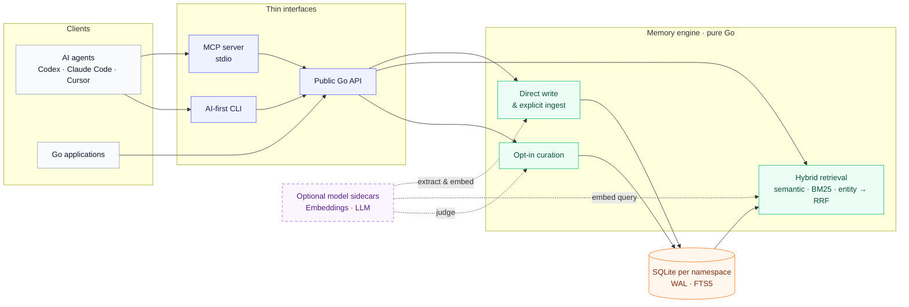

<h1 align="center">engram</h1>

<p align="center">
  <strong>Local-first long-term memory for AI agents.</strong>
</p>

<p align="center">
  Pure Go · Embedded SQLite · MCP &amp; CLI · Hybrid retrieval
</p>

<p align="center">
  <a href="README.zh-CN.md">简体中文</a>
  · <a href="#quick-start">Quick start</a>
  · <a href="#architecture">Architecture</a>
  · <a href="#benchmarks">Benchmarks</a>
  · <a href="docs/README.md">Documentation</a>
</p>

<p align="center">
  <a href="https://github.com/wallfacers/engram/actions/workflows/ci.yml"></a>
  <a href="https://go.dev/"></a>
  <a href="https://github.com/wallfacers/engram/blob/master/LICENSE"></a>
  
</p>

engram gives Codex, Claude Code, Cursor, and custom agents durable memory
without requiring a hosted database. Every namespace lives in its own local
SQLite file, and the same pure-Go engine is available through an MCP stdio
server, an automation-friendly CLI, and embeddable Go packages.

Start with fully offline read/write and keyword retrieval. Add compatible local
or remote model endpoints only when you want semantic search, conversation
fact extraction, or memory curation.

## Why engram

| | |
|---|---|
| **Local by default**<br>Data stays in SQLite on your machine. Core paths need neither a cloud account nor a network connection. | **Useful without models**<br>CRUD, namespaces, export, and keyword retrieval remain available when every model endpoint is absent. |
| **Hybrid when available**<br>Semantic, BM25 keyword, and entity signals are combined with tuning-free Reciprocal Rank Fusion. | **Explicit lifecycle**<br>Agents decide when to write or ingest. Curation is shipped but opt-in; ordinary chat is never captured implicitly. |
| **One engine, thin adapters**<br>MCP and CLI call the public engine API instead of reimplementing memory behavior. | **Portable deployment**<br>Pure Go, no CGO, an embedded database, and no separate vector database to operate. |

## Quick start

### 1. Install the agent skill

Prerequisites: Node.js >=22.20.0, npx/npm, Git, and network access. The command
installs only the skill; install the CLI and configure the MCP server
separately. With `--global`, `skills@1.5.20` writes `~/.claude/skills/engram`
(Claude Code) and `~/.agents/skills/engram` (Codex/OpenCode); Codex and OpenCode
scan `~/.agents/skills/`, so the package is discovered as-is with no extra step.

```bash
npx --yes skills@1.5.20 add https://github.com/wallfacers/engram/tree/engram-skill-v0.1.0/skills/engram --global --agent claude-code --agent codex --agent opencode
```

Keep the installer's write confirmation; choose `Symlink` (default) or `Copy`
on restricted filesystems. After install, reload each client and verify it
discovers exactly one `engram` skill. For project scope, one-client installs,
offline/manual fallback, upgrades, and recovery, see the canonical [skill
installation reference](skills/engram/references/install.md).

### 2. Build and use the CLI offline

Requires Go 1.25 or newer.

```bash
git clone https://github.com/wallfacers/engram.git
cd engram

mkdir -p bin
CGO_ENABLED=0 go build -o ./bin/engram ./cmd/engram
export ENGRAM_DATA_DIR="$PWD/data"

./bin/engram add \
  --name preferred-editor \
  --content "The user prefers Neovim for Go development." \
  --category preference

./bin/engram search "Neovim"
```

The example creates `data/default.db` and performs a degraded-but-functional
offline search. Configure an embedding endpoint later to add the semantic lane;
your existing data and commands stay the same.

Common commands:

```bash
./bin/engram get preferred-editor
./bin/engram list
./bin/engram stats
./bin/engram export
./bin/engram delete preferred-editor
./bin/engram namespaces
./bin/engram version
```

See the [CLI guide](docs/guides/cli.md) for ingest, curation, namespaces, and
automation behavior.

### 3. Connect an MCP client

Build the stdio server:

```bash
CGO_ENABLED=0 go build -o ./bin/engram-mcp ./cmd/engram-mcp
```

Register the absolute binary path in your MCP client. The surrounding config
shape varies by client:

```json
{
  "mcpServers": {
    "engram": {
      "command": "/absolute/path/to/engram/bin/engram-mcp",
      "args": ["--data-dir", "/absolute/path/to/engram-data"]
    }
  }
}
```

With no model configuration, the server exposes CRUD plus lossless
`memory_ingest_v2` and the `memory_evidence_get`/lifecycle tools. Configure an
LLM to add legacy `memory_ingest` fact extraction. Each tool accepts a
namespace; namespaces are isolated in separate database files.

See the [MCP server guide](docs/guides/mcp-server.md) for client integration,
tool boundaries, and opt-in curation.

## Architecture



The solid path is local. Model connections are optional:

1. **Write:** `add` / `memory_write` stores caller-provided content directly;
   explicit `ingest` uses an LLM to extract durable facts before writing.
2. **Search:** keyword search always runs locally. Indexed entity matches and
   semantic cosine results join the ranking when their data and dependencies
   are available; RRF fuses the lanes that succeeded.
3. **Curate:** a bounded pass scores and deduplicates memories. It runs only
   when explicitly invoked by the CLI or enabled for the MCP server.

For implementation boundaries, storage primitives, and provenance, read the
[memory-system architecture](docs/architecture/memory-system.md).

## Capability matrix

| Capability | Default | Optional dependency |
|---|---|---|
| Local CRUD, list, stats, export | Available offline | None |
| Keyword retrieval | Available offline | None |
| Entity retrieval | Used when entity facts are indexed | Facts are produced by explicit ingest |
| Semantic retrieval | Gracefully omitted | OpenAI-compatible embedding endpoint |
| Conversation fact extraction | Not exposed without a model | OpenAI or Anthropic-compatible LLM |
| Memory curation | Opt-in | LLM; explicit CLI command or MCP enablement |
| Namespace isolation | One SQLite file per namespace | None |

engram is currently designed for local, single-user workloads in the
approximately 100k-entry class. It is not a distributed vector service, and it
does not yet claim complete memory freshness or state-consistency guarantees.
See [current capabilities](docs/product/capabilities.md) for the authoritative
shipped/planned boundary.

## Configuration

Non-secret flags override their `ENGRAM_*` environment equivalents. API keys
are environment-only: they are never accepted as command-line flags.

| Flag | Environment | Purpose |
|---|---|---|
| `--data-dir` | `ENGRAM_DATA_DIR` | Directory containing namespace databases |
| `--namespace` | `ENGRAM_NAMESPACE` | CLI namespace; defaults to `default` |
| `--embed-base-url` | `ENGRAM_EMBED_BASE_URL` | OpenAI-compatible embedding endpoint |
| `--embed-model` | `ENGRAM_EMBED_MODEL` | Embedding model name |
| — | `ENGRAM_EMBED_API_KEY` | Embedding API key |
| `--llm-provider` | `ENGRAM_LLM_PROVIDER` | `openai` or `anthropic` |
| `--llm-base-url` | `ENGRAM_LLM_BASE_URL` | LLM endpoint |
| `--llm-model` | `ENGRAM_LLM_MODEL` | LLM model name |
| — | `ENGRAM_LLM_API_KEY` | LLM API key |
| `--max-open-namespaces` | `ENGRAM_MAX_OPEN_NAMESPACES` | MCP namespace cache limit; default `64` |
| `--curation-enabled` | `ENGRAM_CURATION_ENABLED` | Enable persistent MCP curation; default `false` |

The final two rows are MCP-server settings. Run `engram-mcp --help` against
your installed version for its exact startup contract.

## Benchmarks

> **Read before comparing:** every number is a function of
> **dataset × answerer × judge × recipe**, not simply "engram's score".
> Cross-row comparison is valid only when the other axes are controlled.
> 🔬 means measured by this project; 📣 means vendor self-report, not reproduced.
> The [current evaluation results](docs/evaluation/results.md) are the source of
> truth for scores and comparison limits.

**Unified conditions:** `bge-large-en-v1.5` 1024d embedding from a local
sidecar; judging uses the mem0-aligned prompt. Every score is a function of
**dataset × answerer × judge × recipe**; only rows on the same stack are
directly comparable.

### Current best (LoCoMo)

The highest verified engram result on LoCoMo today — independently reproduced
from the original 3-rep answer runs, with a clean (thinking-stripped) judge so
the number carries no judge leakage:

| Dataset (n) | Answerer | Judge | Recipe | Score |
|---|---:|---|---|---:|
| **LoCoMo (1540)** | **Qwen3.6-35B · local vLLM** | deepseek-v4-flash | thinking · top-k 150 · 3-rep majority · **clean rejudge** | **91.10%** (1403/1540) |

Clean rejudge = `extractFinalAnswer` strips the thinking preamble before
judging, removing ~1.5pp of judge leakage that the raw (thinking-inclusive)
judge was adding (see [judge-final-answer-regime](docs/evaluation/reports/judge-final-answer-regime.md)).
The number is reproducible: the same 3-rep data rejudged independently lands on
exactly 1403/1540 ([repro report](docs/evaluation/reports/locomo-9110-repro-2026-08-12.md)).

### How we got to 91.10%

Every step is a verified, attributable change — no score here is a claim without
its own evidence file:

| Step | Change | LoCoMo (n=1540) | Evidence |
|---|---|---|---:|
| 1 · Base | canonical hybrid recipe, no thinking | 85.71% | [results.md](docs/evaluation/results.md) |
| 2 · Trace | read-side evidence mediation (default-on) | 85.91% @ ~468 tok | [030 verdict](docs/evaluation/reports/030-evidence-mediation-verdict.md) |
| 3 · Thinking | deep-thinking answerer, 3-rep mean | 88.23% | [topk exploration](docs/evaluation/reports/topk-exploration-2026-08-11.md) |
| 4 · Top-k 150 | wider recall (32k ctx), 3-rep majority | 90.13% | [topk exploration](docs/evaluation/reports/topk-exploration-2026-08-11.md) |
| 5 · Clean judge | thinking-stripped rejudge of step 4 | **91.10%** | [repro report](docs/evaluation/reports/locomo-9110-repro-2026-08-12.md) |

### Same-stack measurements

Same machine, Qwen answerer, bge-large embedding, judge prompt, and judge
model; competitors run their own code without modifications. Only the
highest-meaning rows are kept — earlier intermediate runs are in the table
above.

| Dataset (n) | Framework | Answerer | Judge | Score |
|---|---|---|---|---:|
| LoCoMo (1540) · best | **engram** 🔬 | Qwen3.6-35B · local vLLM (thinking, 32k ctx) | deepseek-v4-flash | **91.10%** · clean 3-rep majority |
| LoCoMo (1540) | engram 🔬 | deepseek-v4-pro · API | deepseek-v4-flash | **89.03%** |
| LongMemEval-S (500) | engram 🔬 | deepseek-v4-pro · API | deepseek-v4-flash | **86.00%** |
| LoCoMo (1540) | MemOS 🔬 | Qwen3.6-35B · local vLLM | deepseek-v4-flash | 82.40% |
| **LongMemEval-S (500)** | **engram** 🔬 | Qwen3.6-35B · local vLLM | deepseek-v4-flash | **80.80%** |

### Best reported results across different stacks

These numbers are useful context, but they are **not directly comparable**:

| Dataset | engram 🔬 | MemOS 📣 | Mem0 📣 |
|---|---:|---:|---:|
| LoCoMo | **91.10%** (thinking · top-k 150, n=1540, clean) | 88.83% | 92.5% |
| LongMemEval | **86.00%** (v4-pro, S-cleaned 500) | 89.20% | 94.4% |

### LoCoMo by category

Two views of the same 1,540 questions. **Current best** (91.10% recipe:
thinking + top-k 150, clean 3-rep majority) shows where engram stands today;
**same-stack Δ** (base recipe vs MemOS under identical conditions) is the only
controlled comparison.

| Category | n | Current best (clean 3-rep) | same-stack Δ engram−MemOS (base recipe) |
|---|---:|---:|---:|
| single-hop | 841 | **91.8%** | +6.18pp |
| multi-hop | 282 | **95.7%** | −1.77pp |
| temporal | 321 | **91.9%** | −0.62pp |
| open-domain | 96 | 68.8% | **+6.24pp** |
| **Overall** | **1540** | **91.10%** | +3.31pp (paired p=0.002895) |

Two honest caveats. First, the same-stack Δ is measured at the base recipe
(85.71%), where MemOS's tree/graph organization leads on multi-hop (−1.77pp)
and temporal (−0.62pp) while engram leads by 6+ points on single-hop and
open-domain; a stronger engram answerer flips temporal too. Second, the 91.10%
category splits come from a different recipe (thinking + top-k 150), so they
are **not** comparable to MemOS — the high multi-hop/temporal numbers there
reflect the stronger recipe, not a same-stack mechanism advantage. Open-domain
(68.8%) remains the weakest category on both views and is the honest frontier
for further work.

### Three controlled deltas

| Axis | Controlled change | Net effect | Interpretation |
|---|---|---:|---|
| **Framework** | engram − MemOS, LoCoMo 1540 | **+3.31pp** (v4-flash judge) / **+3.51pp** (v4-pro judge) | Direction holds under both judges; paired McNemar exact **p=0.002895** on 1,529 de-duplicated pairs |
| **Answerer** | Qwen → v4-pro | **+3.32pp** (LoCoMo) / **+5.20pp** (LongMemEval-S, p=0.0049) | Stronger answering primarily improves temporal and open-domain |
| **Judge** | v4-flash → v4-pro | **−2 to −3pp** | Additive shift; the framework delta keeps the same direction |

The framework delta is the only row backed by paired statistical evidence.
The raw 1,540 rows include 11 repeated `(conv, question)` groups; folding
them yields 1,529 paired items (engram 85.68%, MemOS 82.47%, +3.20pp), and a
two-sided exact McNemar test gives **p=0.002895**, driven by single-hop
(p=0.000014). The v4-pro judge saved no per-item verdicts, so its +3.51pp is
not a paired-significant claim. A [context-budget ablation](docs/evaluation/reports/budget-ablation.md)
shows this +3.20pp is entirely budget-driven: aligning engram's answerer
budget to MemOS's ~1059 tokens (from 3614) reverses the gap to −5.62pp
(p=0.000006)—the lead reflects engram's ~3.4× larger context budget, not a
memory-mechanism advantage.

### Read-side evidence mediation — budget-efficient (trace)

A read-side stage (`--trace-mediation`, [spec 030](specs/030-evidence-mediation/spec.md)),
**on by default in the eval harness**, runs the retrieved candidate set through
a small mediator that distils a single grounded evidence statement before
answering; a deterministic fail-closed gate keeps every citation inside the
retrieved boundary. On the full 1,540-question LoCoMo set this drops the answer
context from ~3,614 to ~468 tokens (≈7.7×) at a stable 3-run majority of
**85.91%** (vs base 84.9% single-run / 85.19% historical majority) — higher
accuracy at roughly one-eighth the tokens, with no category regressing.
Category-by-category (trace, 3-run majority): single-hop 88.23% · multi-hop
87.23% · temporal 84.42% · open-domain 66.67%. Because
the token saving holds at any accuracy delta, this is the budget-efficient
counterpart to the budget-driven +3.20pp above — the first "more signal, fewer
tokens" result under the budget-aligned lens. The stage is default-on: it needs
a configured answerer LLM as its sidecar and degrades to the legacy
byte-identical path when the sidecar is unavailable; pass
`--trace-mediation=false` to restore the legacy path explicitly.

Mem0's 92.5% / 94.4% come from its managed platform, including optimizations
that are not present in the open-source SDK, and a `top_200` retrieval budget.
They cannot be reproduced under the same stack, so the true controlled gap to
Mem0 remains **unknown**. MemOS's self-reported 88.83% becomes 82.40% in the
controlled stack, a −6.43 point regime difference driven by answerer and judge
conditions.

Use the [LoCoMo runbook](docs/operations/evaluation/locomo-runbook.md) to
reproduce the canonical recipe.

## Documentation

| Goal | Document |
|---|---|
| Browse all current docs | [Documentation portal](docs/README.md) |
| Install the Claude Code, Codex, or OpenCode skill | [Skill installation reference](skills/engram/references/install.md) |
| Use the CLI | [CLI guide](docs/guides/cli.md) |
| Connect an MCP client | [MCP server guide](docs/guides/mcp-server.md) |
| Understand the runtime | [Memory-system architecture](docs/architecture/memory-system.md) |
| Check shipped vs planned features | [Current capabilities](docs/product/capabilities.md) |
| Inspect benchmark evidence | [Evaluation results](docs/evaluation/results.md) |
| See product direction | [Roadmap](docs/product/roadmap.md) |

<details>
<summary><strong>Repository layout</strong></summary>

```text
memory/         public memory engine, retrieval, extraction, and curation
embedding/      embedding client and optional reranker interfaces
provider/       LLM provider abstraction
store/          pure-Go SQLite setup and migrations
mcpserver/      MCP stdio adapter and namespace registry
cmd/engram/     AI-first CLI
cmd/engram-mcp/ MCP server executable
cmd/locomo-bench/ evaluation harness
docs/           user, architecture, product, evaluation, and operations docs
specs/          contract-first feature specifications and plans
```

</details>

## Development

The hard gate is a complete build and test run with CGO disabled:

```bash
CGO_ENABLED=0 go build ./...
CGO_ENABLED=0 go test -count=1 ./...
go vet ./...

node docs/validation/check-docs.mjs
node --test docs/validation/check-docs.test.mjs
```

Changes to retrieval, extraction, curation, storage, or embedding also require a
comparable evaluation run before merge. The project principles are recorded in
the [memory constitution](.specify/memory/constitution.md); documentation
governance is in [docs/CONTRIBUTING.md](docs/CONTRIBUTING.md).

## License

engram is available under the [Apache License 2.0](LICENSE).
