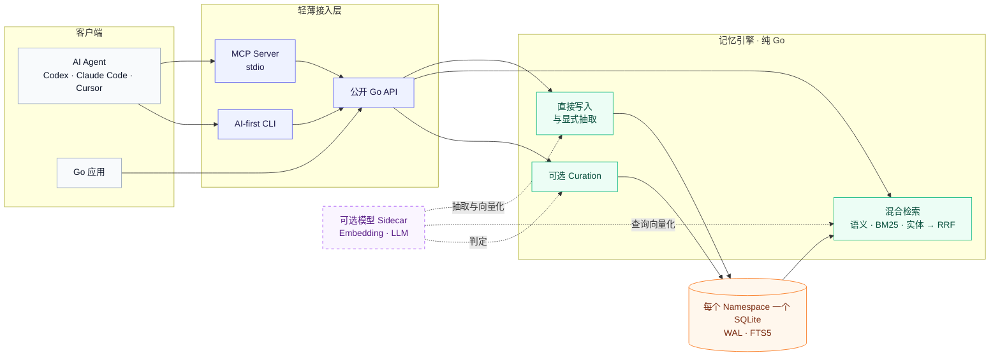

<h1 align="center">engram</h1>

<p align="center">
  <strong>AI Agent 的本地优先长期记忆。</strong>
</p>

<p align="center">
  纯 Go · 嵌入式 SQLite · MCP 与 CLI · 混合检索
</p>

<p align="center">
  <a href="README.md">English</a>
  · <a href="#快速开始">快速开始</a>
  · <a href="#架构">架构</a>
  · <a href="#基准评测">基准评测</a>
  · <a href="docs/README.md">文档</a>
</p>

<p align="center">
  <a href="https://github.com/wallfacers/engram/actions/workflows/ci.yml"></a>
  <a href="https://go.dev/"></a>
  <a href="https://github.com/wallfacers/engram/blob/master/LICENSE"></a>
  
</p>

engram 为 Codex、Claude Code、Cursor 和自研 Agent 提供持久记忆，无需部署托管数据库。
每个命名空间存储为独立的本地 SQLite 文件；同一套纯 Go 引擎可通过 MCP stdio
server、适合自动化的 CLI 和可嵌入的 Go 包使用。

默认即可离线读写并使用关键词检索。只有需要语义检索、对话事实抽取或记忆整理时，
才需要接入兼容的本地或远程模型端点。

## 为什么选择 engram

| | |
|---|---|
| **默认本地**<br>数据保存在本机 SQLite 中，核心路径无需云账号，也不依赖网络。 | **没有模型也能用**<br>未配置任何模型端点时，CRUD、命名空间、导出和关键词检索仍然可用。 |
| **按需混合检索**<br>语义、BM25 关键词和实体信号通过免调参的 RRF（Reciprocal Rank Fusion）融合。 | **显式记忆生命周期**<br>由 Agent 决定何时写入或抽取；curation 已交付但默认关闭，普通聊天不会被隐式采集。 |
| **一个引擎，轻薄适配**<br>MCP 与 CLI 只调用引擎公开 API，不重复实现记忆逻辑。 | **部署简单**<br>纯 Go、无 CGO、嵌入式数据库，不需要单独运维向量数据库。 |

## 快速开始

### 1. 安装 Agent Skill

前置条件：Node.js >=22.20.0、npx/npm、Git 与网络。该命令只安装 skill；CLI
二进制与 MCP server 仍需分别安装和配置。`--global` 下 `skills@1.5.20` 写入
`~/.claude/skills/engram`（Claude Code）与 `~/.agents/skills/engram`（Codex/OpenCode）；
Codex/OpenCode 会扫描 `~/.agents/skills/`，故装完即被发现，无需额外步骤。

```bash
npx --yes skills@1.5.20 add https://github.com/wallfacers/engram/tree/engram-skill-v0.1.0/skills/engram --global --agent claude-code --agent codex --agent opencode
```

请保留安装器的写入确认；默认选择 `Symlink`，受限文件系统选择 `Copy`。安装后重载
各客户端，并确认每个客户端恰好发现一个 `engram` skill。项目作用域、单客户端安装、
离线/手动后备、升级与恢复，请以唯一的 [skill 安装正本](skills/engram/references/install.md) 为准。

### 2. 构建并离线使用 CLI

需要 Go 1.25 或更高版本。

```bash
git clone https://github.com/wallfacers/engram.git
cd engram

mkdir -p bin
CGO_ENABLED=0 go build -o ./bin/engram ./cmd/engram
export ENGRAM_DATA_DIR="$PWD/data"

./bin/engram add \
  --name preferred-editor \
  --content "The user prefers Neovim for Go development." \
  --category preference

./bin/engram search "Neovim"
```

以上命令会创建 `data/default.db`，并完成一次降级但可用的离线搜索。后续配置 embedding
端点即可增加语义检索通道，已有数据和命令无需改变。

常用命令：

```bash
./bin/engram get preferred-editor
./bin/engram list
./bin/engram stats
./bin/engram export
./bin/engram delete preferred-editor
./bin/engram namespaces
./bin/engram version
```

对话抽取、curation、命名空间及自动化行为详见
[CLI 使用指南](docs/guides/cli.md)。

### 3. 接入 MCP 客户端

构建 stdio server：

```bash
CGO_ENABLED=0 go build -o ./bin/engram-mcp ./cmd/engram-mcp
```

在 MCP 客户端中注册二进制文件的绝对路径。不同客户端的外层配置格式可能不同：

```json
{
  "mcpServers": {
    "engram": {
      "command": "/absolute/path/to/engram/bin/engram-mcp",
      "args": ["--data-dir", "/absolute/path/to/engram-data"]
    }
  }
}
```

未配置模型时，server 暴露 CRUD、不可损失的 `memory_ingest_v2` 以及
`memory_evidence_get`/生命周期工具；配置 LLM 后增加旧版事实抽取 `memory_ingest`。每个工具
都可指定 namespace，不同 namespace 使用相互隔离的数据库文件。

客户端接入、工具边界与可选 curation 详见
[MCP Server 配置指南](docs/guides/mcp-server.md)。

## 架构



实线是本地路径，模型连接均为可选：

1. **写入：** `add` / `memory_write` 直接保存调用方提供的内容；只有显式
   `ingest` 才会调用 LLM 抽取持久事实后写入。
2. **检索：** 关键词检索始终在本地运行；实体索引与依赖可用时，实体匹配和语义
   cosine 结果参与排序，RRF 只融合成功返回的通道。
3. **整理：** 有界 curation pass 会评分并去重记忆；只有 CLI 显式调用或 MCP server
   主动开启后才会执行。

实现边界、存储原语与 provenance 详见
[记忆系统架构](docs/architecture/memory-system.md)。

## 能力矩阵

| 能力 | 默认行为 | 可选依赖 |
|---|---|---|
| 本地 CRUD、列表、统计、导出 | 离线可用 | 无 |
| 关键词检索 | 离线可用 | 无 |
| 实体检索 | 已索引实体事实存在时参与 | 实体事实由显式 ingest 产生 |
| 语义检索 | 不可用时自动退出融合 | OpenAI 兼容 embedding 端点 |
| 对话事实抽取 | 无模型时不暴露 | OpenAI 或 Anthropic 兼容 LLM |
| 记忆 curation | 默认关闭 | LLM；CLI 显式命令或 MCP 开关 |
| 命名空间隔离 | 每个 namespace 一个 SQLite 文件 | 无 |

engram 当前面向本地、单用户、约 10 万条记忆规模，不是分布式向量服务，也尚未宣称
完整解决记忆新鲜度与状态一致性。已交付与规划能力的权威边界见
[当前能力边界](docs/product/capabilities.md)。

## 配置

非密钥 flag 会覆盖对应的 `ENGRAM_*` 环境变量。API key 只能通过环境变量提供，
不会作为命令行 flag 暴露。

| Flag | 环境变量 | 用途 |
|---|---|---|
| `--data-dir` | `ENGRAM_DATA_DIR` | namespace 数据库所在目录 |
| `--namespace` | `ENGRAM_NAMESPACE` | CLI namespace，默认 `default` |
| `--embed-base-url` | `ENGRAM_EMBED_BASE_URL` | OpenAI 兼容 embedding 端点 |
| `--embed-model` | `ENGRAM_EMBED_MODEL` | embedding 模型名 |
| — | `ENGRAM_EMBED_API_KEY` | embedding API key |
| `--llm-provider` | `ENGRAM_LLM_PROVIDER` | `openai` 或 `anthropic` |
| `--llm-base-url` | `ENGRAM_LLM_BASE_URL` | LLM 端点 |
| `--llm-model` | `ENGRAM_LLM_MODEL` | LLM 模型名 |
| — | `ENGRAM_LLM_API_KEY` | LLM API key |
| `--max-open-namespaces` | `ENGRAM_MAX_OPEN_NAMESPACES` | MCP namespace 缓存上限，默认 `64` |
| `--curation-enabled` | `ENGRAM_CURATION_ENABLED` | 开启 MCP 持久 curation，默认 `false` |

最后两项是 MCP server 配置。请以当前安装版本的 `engram-mcp --help` 为准确启动契约。

## 基准评测

> **读表前必读：**每一个数字都是
> **数据集 × 答题模型 × 判题模型 × 配方**的函数，不是简单的“engram 得分”。
> 只有其他轴受到控制时，跨行比较才有效。🔬 表示本项目实测；📣 表示厂商自报、尚未复现。
> [当前评测结果](docs/evaluation/results.md)是分数与比较边界的唯一正本。

**统一条件：**使用本地 sidecar 提供的 `bge-large-en-v1.5` 1024d embedding；
engram 使用 canonical hybrid recipe
（`--top-k 30 --chunk-quota 12 --force-answer`，无 reranker）；判题使用
mem0-aligned prompt。

### 同栈实测

这是唯一可以直接比较的表：同一台机器、Qwen 答题模型、bge-large embedding、
相同 judge prompt 和 judge 模型；竞品运行自己的原始代码，不做修改。

| 数据集 (n) | 框架 | 答题模型 | 判题模型 | 得分 |
|---|---|---|---|---:|
| **LoCoMo (1540)** | **engram** 🔬 | Qwen3.6-35B · 本地 vLLM | deepseek-v4-flash | **85.71%** |
| LoCoMo (1540) · trace | engram 🔬 | Qwen3.6-35B · 本地 vLLM | deepseek-v4-flash | **85.91%** @ ~468 tok · 默认 |
| LoCoMo (1540) · thinking | engram 🔬 | Qwen3.6-35B · 本地 vLLM（思考） | deepseek-v4-flash | **88.23%** · 3 次平均 · ci95 [86.85, 89.60] |
| LoCoMo (1540) | engram 🔬 | Qwen3.6-35B · 本地 vLLM | deepseek-v4-pro | 83.77% |
| LoCoMo (1540) | engram 🔬 | deepseek-v4-pro · API | deepseek-v4-flash | **89.03%** |
| LoCoMo (1540) | MemOS 🔬 | Qwen3.6-35B · 本地 vLLM | deepseek-v4-flash | 82.40% |
| LoCoMo (1540) | MemOS 🔬 | Qwen3.6-35B · 本地 vLLM | deepseek-v4-pro | 80.26% |
| **LongMemEval-S (500)** | **engram** 🔬 | Qwen3.6-35B · 本地 vLLM | deepseek-v4-flash | **80.80%** |
| LongMemEval-S (500) | engram 🔬 | deepseek-v4-pro · API | deepseek-v4-flash | **86.00%** |

### 不同评测栈下的各方最好成绩

这些数字可作为背景信息，但**不能直接横向比较**：

| 数据集 | engram 🔬 | MemOS 📣 | Mem0 📣 |
|---|---:|---:|---:|
| LoCoMo | **89.03%**（v4-pro，n=1540） | 88.83% | 92.5% |
| LongMemEval | **86.00%**（v4-pro，S-cleaned 500） | 89.20% | 94.4% |

### LoCoMo 分类别得分

以下结果覆盖类别 1–4 的全部 1,540 道题，使用
`judge=deepseek-v4-flash`，并对三次答题结果进行多数投票。

| 类别 | n | engram (Qwen) | engram (v4-pro) | MemOS，同栈 | Δ engram−MemOS |
|---|---:|---:|---:|---:|---:|
| single-hop | 841 | 88.82% | 90.96% | 82.64% | **+6.18pp** |
| multi-hop | 282 | 87.59% | 88.65% | 89.36% | −1.77pp |
| temporal | 321 | 81.93% | 89.41% | 82.55% | −0.62pp |
| open-domain | 96 | 65.62% | 71.88% | 59.38% | **+6.24pp** |
| **总计** | **1540** | **85.71%** | **89.03%** | **82.40%** | **+3.31pp** |

分类结果比单一总分更有解释力。MemOS 的 tree/graph 组织在 multi-hop 上领先
1.77 个百分点；engram 则在 single-hop 和 open-domain 上领先超过 6 个百分点。
engram 换用更强的答题模型后，temporal 提升 7.48 个百分点、open-domain 提升
6.26 个百分点，但 multi-hop 只提升 1.06 个百分点——这说明 multi-hop 的主要瓶颈
仍在检索侧，而另外两类更受答题模型限制。

### 三个受控差值

| 轴 | 受控变化 | 净效应 | 解读 |
|---|---|---:|---|
| **框架** | engram − MemOS，LoCoMo 1540 | **+3.31pp**（v4-flash judge）/ **+3.51pp**（v4-pro judge） | 两个 judge 下方向一致；1529 个去重配对的配对 McNemar exact **p=0.002895** |
| **答题模型** | Qwen → v4-pro | **+3.32pp**（LoCoMo）/ **+5.20pp**（LongMemEval-S，p=0.0049） | 强答题模型主要改善 temporal 和 open-domain |
| **判题模型** | v4-flash → v4-pro | **−2 至 −3pp** | 产生加性偏移，但框架差值方向不变 |

框架差值是上表唯一有配对统计证据的行。原始 1540 行含 11 组重复问题，按
`(conv, question)` 折叠后得到 1529 个配对（engram 85.68%，MemOS 82.47%，+3.20pp），
双侧 exact McNemar 检验 **p=0.002895**，主要由 single-hop 驱动（p=0.000014）。
v4-pro judge 未保存逐题 verdict，其 +3.51pp 不能声称配对显著。[上下文预算剥离](docs/evaluation/reports/budget-ablation.md)
进一步表明该 +3.20pp 完全由预算驱动：将 engram answerer 预算对齐 MemOS 的
~1059 token（从 3614 降下）后，差距反转为 −5.62pp（p=0.000006）——领先反映的是
engram ~3.4 倍的上下文预算，而非记忆机制优势。

### 读侧证据中介 —— 预算高效（trace）

读侧阶段（`--trace-mediation`，[spec 030](specs/030-evidence-mediation/spec.md)），
**在评测 harness 中默认开启**：先用一个小中介把检索候选蒸馏成一条有据可依的证据，
再交给答题模型；一道确定性的 fail-closed 门保证每个引用都落在检索边界内。在全量
1540 题 LoCoMo 上，答题上下文从 ~3,614 token 降到 ~468 token（约 1/7.7），3 次多数
**85.91%**（vs base 单次 84.9% / 历史多数 85.19%）——更少 token、正确率更高，类别
无回落。分类别（trace，3 次多数）：single-hop 88.23% · multi-hop 87.23% ·
temporal 84.42% · open-domain 66.67%。由于 token 节省在任何正确率差值下都成立，
这是上面"预算驱动 +3.20pp"的预算高效对应物——预算对齐视角下第一个"更少 token、
更多信号"的结果。该阶段默认开启：需要已配置的 answerer LLM 作为 sidecar，sidecar
不可用时优雅降级为 legacy 路径（字节一致）；`--trace-mediation=false` 可显式回到
legacy 路径。

Mem0 的 92.5% / 94.4% 来自托管平台，其中包含开源 SDK 未提供的优化，并使用
`top_200` 检索预算，因此无法在同栈条件下复现，对 Mem0 的真实受控差距仍然
**未知**。MemOS 自报的 88.83% 在受控栈下变为 82.40%，−6.43 个百分点的评测
regime 差异主要来自答题模型与 judge 条件。

canonical recipe 的复现步骤见
[LoCoMo 评测运行手册](docs/operations/evaluation/locomo-runbook.md)。

## 文档

| 目标 | 文档 |
|---|---|
| 浏览全部当前文档 | [文档门户](docs/README.md) |
| 安装 Claude Code、Codex 或 OpenCode skill | [skill 安装正本](skills/engram/references/install.md) |
| 使用 CLI | [CLI 使用指南](docs/guides/cli.md) |
| 接入 MCP 客户端 | [MCP Server 配置指南](docs/guides/mcp-server.md) |
| 理解运行架构 | [记忆系统架构](docs/architecture/memory-system.md) |
| 核对已交付与规划能力 | [当前能力边界](docs/product/capabilities.md) |
| 查看评测证据 | [当前评测结果](docs/evaluation/results.md) |
| 了解产品方向 | [产品路线图](docs/product/roadmap.md) |

<details>
<summary><strong>仓库结构</strong></summary>

```text
memory/         公开记忆引擎、检索、抽取与 curation
embedding/      embedding client 与可选 reranker 接口
provider/       LLM provider 抽象
store/          纯 Go SQLite 初始化与 migration
mcpserver/      MCP stdio 适配器与 namespace registry
cmd/engram/     AI-first CLI
cmd/engram-mcp/ MCP server 可执行程序
cmd/locomo-bench/ 评测工具
docs/           使用、架构、产品、评测与运维文档
specs/          契约优先的功能规格与计划
```

</details>

## 开发

硬性门禁是关闭 CGO 后完成全部构建与测试：

```bash
CGO_ENABLED=0 go build ./...
CGO_ENABLED=0 go test -count=1 ./...
go vet ./...

node docs/validation/check-docs.mjs
node --test docs/validation/check-docs.test.mjs
```

检索、抽取、curation、存储或 embedding 的变更在合入前还必须完成可比较的评测。
项目原则见[记忆系统宪法](.specify/memory/constitution.md)，文档治理见
[docs/CONTRIBUTING.md](docs/CONTRIBUTING.md)。

## License

engram 基于 [Apache License 2.0](LICENSE) 开源。
