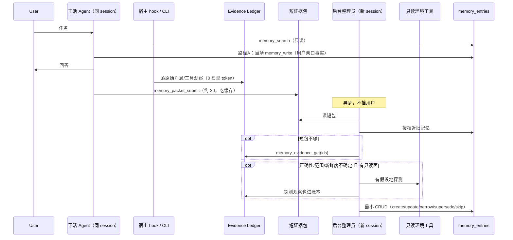

# engram：缓存友好的「先压包、再核对」记忆设计

> 给 [wallfacers/engram](https://github.com/wallfacers/engram) 用。
> 来源：
> 1. 微软论文 *Grounding Agent Memory*（[arXiv:2609.11060](https://arxiv.org/abs/2609.11060)）
> 2. TypeSafe **Jev**（2026-09 起在 X 上爆的 System-One 决策模型）以及 Jev-Mem / jev-recall 的用法
> 3. engram 自己的 LoCoMo / LongMemEval：top-150 高分，以及「加量涨点」的代价
> 地位：设计提案，不是当前产品能力。不改「显式写入、离线可降级、namespace 隔离」这三条底线。
> 日期：2026-09-23
>
> 结构：§0–17 写时核对与短包；**§18 起是读记忆、top-k、Jev 筛压缩与跑分**。

---

## 0. 一句话

论文值得抄的是：**写进长期记忆之前，去环境里核对一遍**。

论文不该抄的是：**另开一个模型把整场过程再读一遍**。在前缀缓存时代，这一步偏亏。

engram 其实已经有半套基础设施（Evidence Ledger、`memory_evidence_get`、supersession、opt-in curator）。缺的是：

1. 干活 Agent **同一条 session 末尾**交出短证据包（吃缓存）
2. 原始过程由 **宿主 hook** 落账本，**禁止模型再抄一遍全文**
3. 后台整理员只吃短包，必要时按 ID 抽一段原文、只读探环境，再决定写/改/删
4. 把「新鲜度」从 backlog 做成可审计状态，而不是再训练一个检索模型

---

## 1. 先对齐：论文在干什么，engram 已经有什么

### 1.1 论文的原方案（不要原样搬）

```
干活 Agent 做完题
        │
        ▼
另开「蒸馏器」session  ← 把完整过程再读一遍（这里最亏）
        │
        ▼
另开「整理员」session  ← 看蒸馏稿 + 对错分数，可选再查环境
        │
        ▼
写入记忆库；下一题干活 Agent 只能读，不能写
```

他们主表里的「更便宜」**只算干活 Agent**，蒸馏和整理另记账且正文不公开。

### 1.2 engram 今天实际在干什么

| 能力 | 现状 | 对应论文哪一块 |
|---|---|---|
| `memory_write` | 干活 Agent **当场**写入用户披露的稳定事实（skill 要求同一轮写完） | 论文禁止干活的人写记忆；你们刚好相反，对偏好类事实这是对的 |
| `memory_ingest` | 把对话丢给 LLM 抽事实 | 论文的蒸馏器，且是**新调用、再读全文** |
| `memory_ingest_v2` | 先把原文写入 Evidence Ledger，没模型也能保存 | 论文的「暂存原始轨迹」，你们更强 |
| `memory_evidence_get` | 按 ID 取原文，不必整段塞进上下文 | 论文没有这一层，整理员要么看压缩稿要么翻整文件 |
| curator worker | 压力到了才打分、去重、合并、淘汰 | 仓库卫生，**不是**「这条还对不对」 |
| provenance / supersession / revision | 有原语 | 论文的 update/narrow/delete |
| 新鲜度 backlog | **明确未实现** | 论文用探测部分覆盖，但不完整 |
| `toExtractionMessages` | **丢掉 tool 消息**，只留 user/assistant 文本 | 对编程 Agent 是硬伤：可复用的办法常常在工具结果里 |

### 1.3 该抄 / 不该抄 / 该补

**该抄**

- 整理发生在任务结束之后，不挡用户
- 记「以后能照着做的办法」，不记这题答案
- 提出 → 核对 → 再提交（propose–probe–commit）
- 核对只用只读环境，整理员没有生产写权
- 干活时的检索接口尽量不动，增益来自「写进去的东西更靠谱」

**不该抄**

- 为了压缩另开 session 再吞一遍全过程
- 让模型把整段对话作为 tool 参数再发一遍（那是**输出 token**，比输入还贵）
- 把蒸馏/整理成本藏起来
- 每条记忆都去环境里逛一圈
- 把 Git/数据库/文件系统探针做进 engram 核心（违反你们「宿主决定何时抽取、引擎不 Implicit 刮环境」）

**该补（论文的坑 + engram 的坑）**

| 坑 | 谁的 | 补法 |
|---|---|---|
| 新 session 再读 100 份过程 | 论文 | 同一 session 只产出短包；原文由宿主 hook 落账本 |
| 主表不算整理费 | 论文 | 分项记账：干活 / 短包 / 整理 / 探测 |
| 笔记已经够清楚还去探 | 论文 | 有把握就跳过探测 |
| 探测本身也可能错 | 论文 | 探测也进账本，能 tombstone / 回滚 |
| 环境一直在变 | 两边 | `last_verified_at` + 过期再探（补新鲜度 backlog） |
| tool 轨迹被丢掉 | engram | 新增 `tool_observation` 证据类型，仍由宿主显式提交 |
| curator 只做去重 | engram | 卫生 curator 保留；另加「核对 curator」，两者不要混成一个 LLM 调用 |
| skill 把「当前环境里有什么」排除在记忆外 | engram | 用户偏好继续当场写；**可复用的环境地图**走短包+核对 |

---

## 2. 目标形态（请按这个抄）

三条路径，不要合成一条。

```
┌─────────────────────────────────────────────────────────────┐
│ 路径 A  用户亲口说的稳定事实                                   │
│  「我用 pnpm」「过敏花生」                                      │
│  保持今天 skill：同一轮 memory_write，吃前缀缓存，立刻可检索     │
└─────────────────────────────────────────────────────────────┘

┌─────────────────────────────────────────────────────────────┐
│ 路径 B  这局任务里发现的可复用结构（论文要抄的）                  │
│  仓库怎么构建、表怎么 join、配置在哪个文件、这条弯路别再走         │
│  1. 宿主 hook：原文进 Evidence Ledger（0 模型 token）           │
│  2. 同 session 末尾：模型只交短证据包（吃前缀缓存）               │
│  3. 后台整理员：短包 + 按需 evidence_get + 只读探测 → 再提交     │
└─────────────────────────────────────────────────────────────┘

┌─────────────────────────────────────────────────────────────┐
│ 路径 C  仓库卫生（你们已有）                                    │
│  近重复合并、低价值淘汰、pinned 保护                             │
│  继续 shipped-opt-in，不要塞进核对流程里                         │
└─────────────────────────────────────────────────────────────┘
```

原则：**engram 继续做记忆引擎，不当 Agent 运行时。**  
探测用的读文件/查库工具留在宿主（Claude Code / Codex / Cursor）。整理员是宿主里的一个后台 Agent，只拿到 engram 的写权和一套只读环境工具。

---

## 3. 为什么「同 session 短包」比论文的蒸馏器便宜

### 3.1 三种付费方式

假设一场任务上下文大约是 `100`，真正值得留下的大约是 `20`（这是数量级，不是承诺）。

| 做法 | 模型要付的钱 | 缓存 | 评价 |
|---|---|---|---|
| 论文：另开蒸馏器再读 100，再写 20 | 输入 100 原价 + 输出 20 | 系统提示词一换，**缓存作废** | 亏 |
| 模型把 100 抄进 `memory_ingest_v2` 参数 | **输出 100** 原价 | 前面的 100 输入可缓存，但你又生成了 100 | 更亏 |
| **同 session 只生成 20 的短包** + 宿主把日志直接写入 Ledger | 输入 100 走缓存（常见 1～5 折）+ 输出 20 | 工具列表从头就固定，前缀对得上 | 该用这个 |

关键点，写进实现注释里：

1. **压缩比再高，也救不了「再读一遍 100」**；救的是后面整理员反复读的那一段。
2. **禁止让模型复述全文。** 原文已经在宿主磁盘/会话日志里，用 CLI/hook 进 Ledger。
3. 短包目标不是「原文的 20%」，而是「整理员能决定写什么的证据目录」：发现了什么、不确定什么、原始证据 ID 是哪些。
4. 最终记忆条目往往比短包更短（几句话）。100→20 是短包；100→2 才是手册。

### 3.2 前缀缓存落地时的陷阱（必须避开）

前缀缓存按「从左到右完全一致」命中。下面三件事会把整场 100 的折扣打掉：

1. **最后一轮才把 `memory_packet_submit` 加进 tools 列表** → 工具定义在前缀里，中途变更 = 整段 miss。  
   **做法：** 工具从 session 开头就在列表里，只是 skill 规定「交卷前不准调用」。
2. **为了总结去改 system prompt** → miss。  
   **做法：** 只在末尾追加一条很短的用户/系统消息：「任务结束，请提交证据包」。
3. **整理员和干活的共用一条 session** → 整理员的只读环境工具会污染前缀，也可能让干活的人中途改记忆。  
   **做法：** 整理员必须新 session；它只吃 20，不需要那 100 的缓存。

### 3.3 分项账单（论文没公开，engram 要做）

每次任务结束后写一行 telemetry（可先打日志，不必立刻做产品面板）：

```
task_id, namespace, session_id
tokens_task_in, tokens_task_cached, tokens_task_out, usd_task
tokens_packet_out, usd_packet          # 同 session 末尾那一下
tokens_curator_in, tokens_curator_out, usd_curator
probe_calls, usd_probe                 # 可并入 curator
entries_created, entries_updated, entries_skipped
payback_hint                           # 相对「无记忆」省下的检索/探索，能记就记
```

没有这张表，就不要对外说「更便宜」。

---

## 4. 端到端流程



整理必须在下一任务开始前结束，或下一任务只读「已提交」的条目。不要出现半写状态被检索到。用你们已有的 revision / if-unchanged 语义。

---

## 5. 接到现有代码上（尽量少动核心）

### 5.1 不动的

- namespace 独立 SQLite
- 离线 keyword / CRUD
- `memory_write` 的「同一轮、写一次」skill 合同（路径 A）
- Evidence Ledger 的 append-only、digest、tombstone/restore/purge
- curator worker 的打分/去重/淘汰（路径 C）
- 「引擎不 Implicit 刮环境」

### 5.2 建议新增（引擎侧，薄）

| 新增 | 放哪 | 干什么 |
|---|---|---|
| 证据类型 `tool_observation` | `memory/evidence.go` 的 `EvidenceSourceType` | 工具名 + 截断后的观察，仍由宿主显式 Append |
| 证据类型 `probe_observation` | 同上 | 整理员探测到的只读结果，便于审计和回滚 |
| `memory_packet_submit` | `mcpserver/tools.go` | 接收短证据包，写成一种 projection，**不直接变成可检索 lemma** |
| 条目字段 `confidence` / `applies_to` / `last_verified_at` / `verify_method` | `memory_entries` 或 projection 元数据 | 补新鲜度 backlog 的最小状态模型 |
| `memory_commit` 或扩展 write | MCP | 整理员专用：带 `if_unchanged` + 证据引用的提交 |
| CLI `engram packet-submit` / `engram ledger-append` | `cmd/engram` | 给 hook 用，不经过模型 |

### 5.3 建议新增（宿主 / skill 侧，厚）

| 新增 | 干什么 |
|---|---|
| session-end hook | 把本局消息和工具观察 append 进 Ledger；然后提示模型提交短包 |
| 整理员 skill（独立） | 新 session：engram 写工具 + 宿主只读工具；prompt 用提出-核对-提交 |
| 只读工具白名单 | 文件系统读、grep、读 package.json / schema；**没有** 写文件、git push、删库 |
| 探测预算 | 默认每包最多 8 次只读调用；超了就降级为「低置信、未核对」 |

整理员不要做成 `memory/curation/worker.go` 里多一次 Judge。现在的 Judge 输入是条目摘要，没有环境，职责是去重。硬塞进去会把两种失败模式缠在一起。

---

## 6. 短证据包：100 压到 20 时到底留什么

短包是给整理员的**目录**，不是最终记忆，也不是会议纪要。

硬上限建议：

- 总长 ≤ 2000 token（约 1500 汉字 / 2500 英文词量级，按你们 tokenizer 再校准）
- 单条候选 lemma ≤ 400 字
- 最多 8 条候选
- 必须带 `evidence_ids`（Ledger 里已有的 ID），禁止把大段原文粘进来

```json
{
  "schema": "engram.packet.v1",
  "session_id": "claude-code:proj:2026-09-23T12:00:00Z",
  "namespace": "default",
  "task": "给支付服务加幂等键",
  "outcome": "done",
  "feedback": {
    "type": "none | user_correction | test_pass | test_fail | unknown",
    "note": "测试过了 / 用户说记错了。没有就 none。不要假装有分数。"
  },
  "discovered": [
    {
      "kind": "procedure | schema | convention | trap | state | preference",
      "claim": "幂等键在 `internal/pay/idempotency.go`，按 `Idempotency-Key` 头去重",
      "applies_to": "支付服务写路径",
      "confidence": "low | medium | high",
      "support_ids": ["ev_01", "ev_02"],
      "uncertain": "是否也覆盖退款路径，这局没走到"
    }
  ],
  "do_not_store": [
    "这局具体订单号",
    "这次失败的临时 stack trace 全文"
  ],
  "open_questions": [
    "退款是否共用同一张幂等表"
  ]
}
```

skill 对干活 Agent 的提交指令（可直接改 SKILL.md 附录）：

```
任务结束后调用 memory_packet_submit，只提交短包。
禁止把对话或工具输出原文贴进短包。
只写可复用的结构、步骤、陷阱、范围，以及对应 evidence_id。
不要把本题答案、一次性数值、密钥写进去。
没有把握的范围写进 uncertain，不要写成全称判断。
用户亲口偏好若本轮已 memory_write，不要在短包里再写一遍。
```

关于「100 能压到 20 吗」：

- 工具结果很长（日志、SQL、diff）：**经常可以**，短包只留「哪张表、哪个文件、哪条命令」。
- 几乎全是推理、几乎没工具：**很难**，那就诚实写 40～50，但仍然禁止复述全文。
- 达不到上限也没关系；整理员要的是可执行候选，不是压缩比赛。

---

## 7. 整理员：提出 → 核对 → 提交

和论文同一套，但证据来源换成 engram 已有的三样：短包、Ledger 切片、旧条目。

### 7.1 提出

从短包 + `memory_search(claim)` 拉出旧条目，生成原子候选：

- 新建
- 更新/合并到已有 name
- 收窄 `applies_to`
- 用 supersession 替代
- 跳过（一次性、无证据、已有更好的）

### 7.2 什么时候探，什么时候不探

| 情况 | 动作 |
|---|---|
| 用户亲口偏好（路径 A 已写） | 不探 |
| 候选是「别再走这条弯路」，且短包里有失败观察 ID | 通常不探，低置信入库即可 |
| join / 文件路径 / 命令 / schema：**短包标了 uncertain** | 探 |
| 旧条目 `last_verified_at` 超过 TTL（见 §8） | 探 |
| 没有只读面（纯闲聊、无工作区） | 不探，`verify_method=packet_only`，置信降一档 |
| 已经 high 且证据 ID 指向稳定文件/用户确认 | 不探 |
| 探测预算用尽 | 停，未核对的候选降置信或 skip |

探测必须**带着假设**，禁止「既然有工具就先 ls 一下整个家目录」。

编程场景里的合法探测例子：

- `read_file internal/pay/idempotency.go` 确认短包说的符号还在
- `grep Idempotency-Key` 看退款路径有没有
- 读 `package.json` 确认包管理器（若这条来自环境发现而不是用户亲口）
- 跑只读 `git log -1 -- path` 看约定是否过期

非法：

- 改文件来「试一下」
- 为了下一题提前把仓库逛完
- 把探测到的密钥写进记忆

### 7.3 提交合同（对着现有 store）

每条提交必须带：

```
name
content                 # lemma，正面说「该怎么做」
category                # 沿用你们已有分类，另加 procedure / schema / trap（若要改枚举，走 spec）
trigger                 # 对应 applies_to，检索用语
confidence
verify_method           # packet_only | env_probe | user_confirmed
last_verified_at
source_evidence_ids     # 含原始 + 探测
supersedes              # 可选，旧 name/id
```

写入规则（写进整理员 prompt，也写进引擎校验）：

1. 不记本题答案、rubric、一次性数值
2. 范围不超过证据
3. 成功不等于中间假设都对（你们 ingest 已有类似精神，这里要执行）
4. pinned 条目整理员不得删、不得 quiet supersede
5. 用已有 `MergeIfUnchanged` / `SupersedeIfUnchanged`，冲突就跳过
6. 宁可少写，不要堆噪声

### 7.4 整理员 prompt 骨架（相对论文 D.2/D.3 的 engram 版）

论文整理员 prompt 几乎可以复用，只改三处：

1. Available tools = engram CRUD/search/evidence_get **加上** 宿主只读工具（若有）
2. 在 Check 和 Reconcile 之间插入：不确定才探；探是为了评估候选，不是解题
3. 原始过程默认不在上下文里，需要时 `memory_evidence_get`

不要给整理员 `memory_ingest`。它不是再抽一遍对话的人。

---

## 8. 补论文没做的：新鲜度（对着你们 backlog）

[docs/product/backlog/memory-freshness.md](https://github.com/wallfacers/engram/blob/master/docs/product/backlog/memory-freshness.md) 现在只定义了问题，没有状态模型。建议最小模型如下，先不要上「习惯记忆」或训练 compiler。

### 8.1 条目状态

```
active          可检索
superseded      被替代，默认不检索，可审计
unverified      仅有短包、从未探测或用户未确认；检索可降权
stale           过了 TTL 或探测失败；检索可降权或附警告
tombstoned      来源撤回（已有 Evidence 生命周期）
```

supersession **仍然不是真伪判定**（provenance.md 的原话要遵守）。`stale` 表示「可能过期」，不是「一定错」。

### 8.2 TTL 只按种类，不按全球一个数

| kind | 建议 TTL | 理由 |
|---|---|---|
| preference / identity（用户亲口） | 直到用户改口 | 探环境没有意义 |
| convention / procedure | 7～30 天或文件 mtime 变化 | 代码会变 |
| schema | 探测失败立即 stale | 论文 CLBench 迁移场景 |
| trap | 14 天 | 弯路可能已修 |
| state（「这周在用 Debian」） | 短，3～7 天 | 容易过期 |

可选：宿主把相关文件的 mtime/digest 写进探测观察，digest 变了就触发再探，比傻等 TTL 准。

### 8.3 无新任务时的刷新

论文只在「刚做完一题」时探。engram 可以更进一步，且仍然 opt-in：

```
engram verify --namespace default --limit 10
```

选出 `utility` 高且过期的 procedure/schema，开一个**没有短包**的整理员，只带旧条目 + 只读工具。这正好填新鲜度 backlog，又不必 Implicit 抓聊天。

---

## 9. 探测错了怎么办（论文几乎没写）

探测观察也是 Evidence：`source_type=probe_observation`。

- 条目通过 `source_evidence_ids` 连到这些观察（你们已有 `memory_projection_sources`）
- 发现探错了：tombstone 那条 probe evidence → 依赖它的 projection 标 stale（Ledger 已有「无 active source 则 stale」）
- 不要直接物理删 lemma，除非用户 purge
- 整理员不得把探测结果当成用户原话

这比论文强：他们只在整理员脑子里看了一眼环境，没有不可变观察记录。

---

## 10. 权限与工具边界

```
干活 Agent
  读：memory_search / get / list / evidence_get（可选）
  写：memory_write（仅路径 A）
      memory_packet_submit（仅任务结束）
  环境：宿主给的正常任务工具（可读可写，按宿主政策）
  禁止：memory_delete 大批量、purge、改他人 namespace

整理员
  读：search / get / evidence_get / list_session
  写：commit/update/supersede（if-unchanged）
  环境：只读白名单
  禁止：生产写、purge、跨 namespace、偷看未结束任务

宿主 hook
  写：ledger append（原文）
  不跑 LLM
```

没有安全只读面时，整理员自动退回 `packet_only`，与论文一致，也符合 engram 离线降级。

---

## 11. skill 怎么改（最小增量）

保留 §0 里「用户披露稳定事实 → 当场写」——那是你们相对论文的优势，而且天然吃缓存。

加一节 **§任务收尾**：

1. 用户说「记住这个偏好」→ 仍走路径 A，不要等整理员
2. 做完一局写代码/查仓库/跑命令 → 不要当场把环境地图 `memory_write` 成一条很长的日记
3. 调用 `memory_packet_submit`，短、带 evidence_id、带 uncertain
4. 下一局需要惯例时：`memory_search` 先搜 **属性词**（包管理器、构建命令、idempotency），规则已有，保持

改一处现有措辞：

> 现在：当前环境里有什么，去问文件系统，不要当记忆。  
> 改成：当前瞬间状态（这个目录现在有哪些文件、进程在不在）问文件系统。  
> **跨 session 还成立的结构**（构建命令、表关系、约定文件位置）走短包，经整理员核对后再成为记忆。

否则你们永远学不会论文真正赚到的那部分：少做重复探索。

---

## 12. 分阶段落地（按这个排期就不会把引擎撑爆）

### MVP（建议 1 个 spec，例如 `specs/049-session-packet`）

1. Ledger 增加 `tool_observation`（宿主 CLI append，内容截断，带 digest）
2. `memory_packet_submit` + 表/projection `memory_packets`
3. session-end：CLI 落日志 + 模型只交短包
4. 后台整理员 **先不探环境**：只吃短包 + evidence_get + 旧记忆，走提出-提交
5. telemetry 四段费用
6. 验收：
   - 模型 tool 参数里看不到全文日志
   - 短包超 2000 token 被拒
   - 路径 A 的当场 write 行为回归不变
   - 离线：无 LLM 时 packet 和 ledger 仍能保存（对标 ingest_v2 degraded）

这一步已经在抄论文的「事后整理」，但用缓存友好的方式，**不必等探测**。

### V1（`specs/050-probe-curation`）

1. 整理员 skill + 只读工具白名单
2. `verify_method` / `last_verified_at` / `confidence`
3. 探测观察入 Ledger
4. 跳过规则 + 每包 8 次预算
5. 验收：同一仓库连续 5 个相关任务，后 3 个的搜索/读文件次数下降；探测次数有上限；无只读面时自动降级

### V2（把 freshness backlog 转 active）

1. TTL + stale 检索降权
2. `engram verify` 周期再探
3. 文件 digest 变化触发
4. 文档：更新 `capabilities.md`、`memory-system.md`，把 backlog 标成 shipped-opt-in

### 明确不做

- 把探测做进 `curation/worker.go` 的 Judge
- 引擎内置 GitHub/SQLite/浏览器探针
- 隐式抓取每一句聊天（违反 explicit lifecycle）
- 为了抄论文去禁止路径 A 的当场 write
- 训练本地 compiler（023）来代替核对——那是另一条路线，别缠在一起

---

## 13. 和现有文件的对应关系

改设计时要同步的正本：

- `docs/architecture/memory-system.md` — 写入/抽取再加「packet / probe」两条
- `docs/architecture/provenance.md` — 探测观察也是来源；supersession 仍非真伪判定
- `docs/product/capabilities.md` — 未出货前写在「明确未实现」
- `docs/product/backlog/memory-freshness.md` — V2 完成前不要假装已保证一致性
- `docs/guides/mcp-server.md` / `skills/engram/SKILL.md`
- `memory/evidence.go`、`mcpserver/tools.go`、`memory/pipeline/ingestor.go`（tool 消息不再默默丢掉）
- `memory/curation/worker.go` — 只加一句：核对不是这个 worker 的职责

---

## 14. 验收时怎么证明「没亏 token」

用你们自己的一次真实编程 session，不要用 LoCoMo 代替（LoCoMo 测的是对话事实，不是环境结构）。

对照四臂：

1. 无记忆
2. 今天的当场 `memory_write` + ingest（可能再读全文）
3. 仅短包、不探测
4. 短包 + 探测

记：

- 后继任务做到同样结果的工具次数
- 四段 USD
- 错误记忆条数（过期表名、错误构建命令）
- 短包命中率（整理员是否还要 evidence_get 大段原文）

成功标准（建议写进 spec 的 Success Criteria）：

- 臂 4 的**总** USD（含整理）在第 3 个相关任务后 ≤ 臂 1
- 臂 3 的总 USD 明显低于「ingest 再读全文」
- 臂 4 相对臂 3：仅在 uncertain/schema 类任务上正确率更高；偏好类任务持平
- 无模型时臂 3 的 ledger+packet 仍成功（degraded）

---

## 15. 给实现的人留的接口草稿

```go
// EvidenceSourceType 增补
const (
    EvidenceSourceMessage          EvidenceSourceType = "message"
    EvidenceSourceDirectWrite      EvidenceSourceType = "direct_write"
    EvidenceSourceToolObservation  EvidenceSourceType = "tool_observation"
    EvidenceSourceProbeObservation EvidenceSourceType = "probe_observation"
    EvidenceSourceLegacyEntry      EvidenceSourceType = "legacy_entry"
)

type EvidencePacket struct {
    Schema      string          `json:"schema"` // engram.packet.v1
    SessionID   string          `json:"session_id"`
    Namespace   string          `json:"namespace"`
    Task        string          `json:"task"`
    Outcome     string          `json:"outcome"` // done | failed | unknown
    Feedback    PacketFeedback  `json:"feedback"`
    Discovered  []PacketClaim   `json:"discovered"`
    DoNotStore  []string        `json:"do_not_store"`
    OpenQuestions []string      `json:"open_questions"`
}

type PacketClaim struct {
    Kind        string   `json:"kind"`
    Claim       string   `json:"claim"`
    AppliesTo   string   `json:"applies_to"`
    Confidence  string   `json:"confidence"`
    SupportIDs  []string `json:"support_ids"`
    Uncertain   string   `json:"uncertain,omitempty"`
}
```

MCP：

- `memory_packet_submit(namespace, session_id, packet)` → `{packet_id, stored:true}`，**不**返回「已写入 N 条记忆」
- 整理员随后 `memory_write` / 新 `memory_commit` 才产生可检索条目
- hook：`engram ledger-append --session ... --type tool_observation --file spans.jsonl`

---

## 16. 决策摘要（可贴进 PR）

1. 抄论文的「写时核对」，不抄「新 session 再读全过程」。
2. 原文进 Ledger 走宿主，不走模型输出。
3. 同 session 只交短包，工具列表从一开始就注册。
4. 用户亲口事实继续当场写；环境结构走短包+整理员。
5. 卫生 curator 和核对 curator 分开。
6. 探测是宿主只读工具，不是 engram 核心。
7. 探测观察进账本，错了能 tombstone。
8. 费用四段记账，用总账判断是否划算。
9. 新鲜度用 TTL + last_verified_at 填 backlog，先别上训练方案。
10. 全部 opt-in，默认离线路径不变。

---

## 17. 和论文数字的心理预期（避免过度承诺）

论文在「同一套隐藏数据库、连续 40 题、中间改 schema」这种设定里，核对把做对比例从 39% 拉到 73%。那是**高度相关、环境可查询**的任务流。

engram 的真实用户是 Codex / Claude Code / Cursor：

- 相关任务很多（同一仓库）→ 值得做 V1
- 大量无关闲聊 → 只靠路径 A，不要为每句聊天开整理员
- 没有工作区只读面 → 永远不要说你实现了这篇论文

先用 MVP 把 token 亏空堵住，再用 V1 在一个仓库里看工具次数掉不掉。掉了，论文的思想才算抄对；只加了更多 LLM 调用、探索没减少，就是把论文的账本陷阱原样搬进了 engram。

---

## 18. 模型什么时候写记忆、什么时候读记忆

检索再强，时机错了也是噪声。这一节先把 **何时动** 写死，下一节才谈 top-k 和 Jev。

### 18.1 写：三条路，不要合成一条

| 时机 | 谁写 | 写什么 | 要不要 Jev / 探测 |
|---|---|---|---|
| **用户亲口稳定事实**（「我用 pnpm」「过敏花生」） | 干活 Agent **当轮** `memory_write` | 一条短事实 | 不必探环境。可用 Jev 挡「这是一次性还是稳定事实」 |
| **这局发现的环境结构**（构建命令、表关系、文件地图） | 先短包，后台整理员定稿 | procedure / schema / trap | 整理员只读探测。Jev 可先判「值不值得探」 |
| **对话抽取** | 仅显式 `ingest_v2` | 原文进 Ledger，抽取可选 | 禁止模型把全文当 tool 参数再吐一遍 |
| **不要写** | — | 本题答案、一次性数值、密钥、当前目录列表、假设性 if | Jev 的 `should_store=false` 应直接 skip |

和 048 隐式飞轮的边界：

- 048 要解决的是：**用户说了用 Neovim，skill 却不写**。那是路径 A，当轮定稿，对的。
- 不要把 048 扩成「凡是稳定事实都当轮 `memory_write`」。环境结构未经核对就入库，论文里那五种错会全回来。

可选的写前门（Jev，opt-in，失败则沿用 skill 规则）：

```
state:  本轮用户话 + 助手即将写入的草稿
questions:
  is_durable:     这是跨 session 还成立的事实，而不是这周的安排或一次性细节？
  is_preference:  这是用户亲口偏好/约束/身份？（是 → 路径 A 当场写）
  needs_probe:    这是环境结构或步骤，离开仓库/数据库无法确认？（是 → 只交短包）
  is_secret:      含密钥、token、隐私？（是 → 不写）
```

四道题一次请求。Jev 不生成文字，只给概率。阈值建议 0.5 起步，用你们自己的标注校准，不要抄别人的 0.5 当真理。

### 18.2 读：先问「这题用不用得着记忆」

skill 现在已经有一份很好的读触发（哪个/我的/上次/老规矩；过敏、时区、分支约定；安装构建前先查惯例）。保持。补三刀：

1. **瞬时环境不问记忆。** 这个目录现在有什么文件、进程在不在，问文件系统。
2. **跨 session 的结构问记忆。** 我们通常怎么构建、幂等键在哪、包管理器是什么。
3. **与问题无关的命中不要塞。** 这就是 Jev 上场的地方：不是「搜到 150 条全给答题模型」，而是「150 里哪些跟这句问题有关」。

可选的读前门（同样 opt-in）：

```
state:  用户问题
questions:
  needs_memory: 不查长期记忆就可能答错或违规？（否 → 不调用 search）
  query_term:   （choice）更该搜哪个属性词：过敏 / 包管理器 / 时区 / 构建 / 其他
```

`needs_memory=false` 时 MCP 都别打。这能省一轮工具，也避免无关记忆污染答题。

读的时候默认仍走 `memory_search`。Jev **不替代** BM25/向量/实体，只在候选集上做「跟这题有没有关」。

---

## 19. 你们 top-150 为什么高分，以及它在生产上的问题

评测正本（`docs/evaluation/results.md`）里，统一答题合同下：

| 基准 | top-k 30 | top-k 150 | 差值 |
|---|---|---|---|
| LoCoMo 1540 题 | 87.9% | **91.43%** | +3.54pp |
| LongMemEval-S 500 题 | 90.2% | **92.0%** | +1.8pp |

这是真涨分，但机制要说清楚，否则会抄错药。

1. **k=30 时 gold 已接近饱和。** 评测记录：再加大 k，主要不是「找回更多漏掉的金块」，而是 **答题模型看见了更长的上下文**（大约 2.4×）。官方自己的说法是「加量型涨点」，大约八成来自灌上下文，不是更深的召回。
2. **k=150 会救回一部分 k=30 没答对的题，也会把一部分答对的题翻错**（稀释、排名变化）。不是单调变好。
3. **生产默认不是 150。** MCP `memory_search` 默认 limit=8，skill 还要求「先搜一个属性词」。评测 k=150 需要 32k 上下文，不能当 Codex/Claude 每轮的默认。
4. **所以高分证明的是：宽候选池有覆盖；并不证明应该把 150 条原文塞进每一轮。**

要保持 150 的覆盖、又不要 150 的噪声，缺的就是 **按当前问题筛一遍，只留下相关的**。这不是再训一个检索模型，是在已有 RRF 候选上做「跟这题有关吗」。

```
召回率（coverage）     靠宽池：k=150 的混合检索
精确率（precision）    靠筛：只留与问题相关的
准确率（answer acc）   靠「相关的那几条」而不是「更多条」
```

Jev 要打的正是中间那一刀。

---

## 20. X 上在火的 Jev 是什么（别和 Jev-Mem 论文混成一个）

两件相关、但不是同一个东西：

### 20.1 TypeSafe Jev（该接的）

2026-09-15 左右发布的 **System One 模型**：不写字，只对「一段材料 + 一组题」给出选项和校准概率。输入大约 $0.042 / 百万 token，输出免费；宣传相对对话 LLM 快一到两个数量级、便宜两个数量级。

请求形状：

```
state:      问题 + 候选记忆（共享一份，带短 id）
questions:  每条记忆一道是/否：「这条对回答或执行当前问题是否必要？」
返回:       每条一个概率，校准过，可按阈值留下，而不是死切 top-k
```

社区已经拿它当记忆过滤器（[jev-recall](https://github.com/samdotmak/jev-recall)）：语义检索会漏「坚果过敏」，Jev 和 Sonnet 都能抓到，Jev 大约 0.35s、每请求约 $0.00044。阈值 0.3～0.5 结果稳。**没有任何相关记忆时可以返回空**——这点比强制 top-5 更重要，能减少胡答。

它不是向量库，也不是生成式 reranker。你们已有的 BM25 + 向量 + 实体 RRF **继续做第一段**；Jev 做第二段「跟这题有关吗」。

### 20.2 Jev-Mem 论文（先别搬架构）

[arXiv:2609.23986](https://arxiv.org/abs/2609.23986) 用 System-One 控制面管记忆分型、图遍历、预算、自适应停，System-Two 只负责最后合成。LoCoMo 上 0.777 judge 分。那是 **另一套记忆操作系统**。

engram 已经有 Ledger、RRF、namespace、离线降级。不要为了追热点改造成 Jev-Mem。能偷的只有一句话：**高频「取舍」不要每回都叫大模型生成。** 落到你们身上，就是候选筛选和写/读门用 Jev，答题仍用现在的模型。

### 20.3 和 engram 底线的冲突（必须写进 spec）

Jev 默认是云 API（TypeSafe / OpenRouter）。你们的默认是本地、没模型也能搜。所以：

- Jev 只能是 **shipped-opt-in**，对标 embedding：有密钥才启用，没有就退回 RRF top-k
- 核心路径禁止 `import` 死绑 TypeSafe
- 本地开源近似（Open-Jev 等）可以后接，但评测分支要单列，不能和 TypeSafe Jev 分数混报
- 密钥走环境变量，skill 不得把 key 写进对话

---

## 21. 接到 engram：宽召回 + 按问题筛压缩

这是本节的核心配方，对应你们已经验证过的 k=150 覆盖：

```
用户问题
   │
   ├─（可选）Jev：这题需不需要记忆？ 否 → 不搜
   │
   ▼
memory_search 宽池   k_wide = 150（或 64/100，用跑分选）
   │  BM25 + 语义 + 实体 → RRF     本地，已有
   │
   ▼
Jev pointer 过滤
   state = { query, memories: [{id, name, content, trigger}] }
   每条一道 noul：这条对回答/执行「当前问题」是否必要？
   留下 p ≥ θ 的，按 p 排序
   │
   ▼
压缩后的短名单   k_show = 空 / 3 / 8（由阈值决定，不是再切死 top-k）
   │
   ▼
答题模型 / 干活 Agent 只看见短名单
```

### 21.1 为什么不是「再用 LLM 把 150 条重排」

| 做法 | 覆盖 | 噪声 | 延迟/钱 | 没相关时 |
|---|---|---|---|---|
| 生产默认 top-8 | 低，评测会掉到 k=30 以下 | 低 | 本地几乎 0 | 仍可能塞 8 条无关的 |
| 评测 top-150 全塞 | 高 | 高，32k 上下文 | 答题贵 | 硬塞 |
| 150 + 生成式 rerank（Haiku/Sonnet） | 高 | 中 | 秒级、美分级 | 看 prompt |
| **150 + Jev 阈值** | 接近 150 的覆盖 | 低 | ~0.3s、约 $0.0004/次 | **可以返回空** |

最后一格是 Jev 相对你们现状的真正增量：把「评测才能用的宽池」变成「生产每轮用得起的宽池」。

### 21.2 阈值，不要 top-k 一刀切

Jev 的概率是校准过的，社区用法是 **过线就留，不过就丢**，不是再取 top-5。

建议默认：

- `θ = 0.5` 起步
- 若 `needs_memory=true` 且全部 < 0.5，降到 0.35 再取最多 3 条（避免「该查却空」）
- 硬顶 `k_show_max = 12`，防止阈值太松又变相 150
- pinned 且 trigger 命中的条目不过 Jev 也注入（用户钉过的约定）

空结果必须诚实返回，skill 已有「空就说空，不许编」。Jev 空和检索空走同一句话。

### 21.3 实现落点（引擎薄、适配器可拔）

不要写进 `retriever.go` 的默认融合。做成和 embedder 一样的可选 sidecar：

```go
type RelevanceFilter interface {
    // Filter 在已检索的候选上按当前 query 打分。
    // 无过滤器或失败时，调用方必须能退回原候选的前 limit 条。
    Filter(ctx context.Context, query string, cands []ScoredEntry) ([]ScoredEntry, FilterMeta, error)
}

type FilterMeta struct {
    Backend    string  // "none" | "jev" | "openjev"
    Theta      float64
    Kept       int
    Dropped    int
    LatencyMs  int
    CostUSD    float64
    Degraded   bool   // 失败则 true，调用方用原 RRF 顺序
}
```

MCP：

```
memory_search(..., limit=8, candidate_pool=150, filter="jev")
返回:
  hits:           过滤后的短名单（scope 仍是 ranked_subset）
  pool_size:      150
  filter:         {backend, kept, dropped, theta, degraded}
```

`candidate_pool` 默认等于 `limit`（行为与今天一致）。显式打开才走宽池+过滤。离线或 Jev 失败：`degraded=true`，退回 `limit` 条 RRF。

宿主若不想改 MCP，也可以 skill 里：先 `memory_search(limit=150)`，再本地调 Jev，再把短名单塞进上下文。引擎内置更好，因为评测 harness 能打到同一条路径。

### 21.4 指针模式怎么组请求（防把 150 条全文变成天价）

pointer 模式：记忆放进共享 `state`，问题只引用 id。不要 inline 把每条全文复制进 150 道题。

```json
{
  "model": "jev-latest",
  "state": {
    "query": "安装依赖该用什么包管理器？",
    "memories": {
      "m1": {"name": "pkg-manager", "text": "用户在 Node 项目里用 pnpm，不用 npm。"},
      "m2": {"name": "editor", "text": "用户编辑 Go 用 Neovim。"}
    }
  },
  "questions": {
    "need_m1": {
      "type": "noul",
      "instructions": "Memory m1 is necessary to answer or act on the query. The query is about which package manager to use."
    },
    "need_m2": {
      "type": "noul",
      "instructions": "Memory m2 is necessary to answer or act on the query. The query is about which package manager to use."
    }
  }
}
```

指令写具体：「对**当前这个问题**有没有必要」，不要写「这条记忆重不重要」。过敏那条在点餐时必要，在问包管理器时不必要——Jev-recall 的 demo 靠的就是这种问题条件化。

池子很大时分片并发（jev-recall 已这么做）。单片建议 32～64 条，避免一道请求里问题互相干扰。

---

## 22. 写记忆时 Jev 也能当门，但不要代替整理员

读侧是刚需。写侧是锦上添花，且不能破坏路径 A 的当轮写入。

| 判断 | 用 Jev | 仍用整理员/探测 |
|---|---|---|
| 是不是一次性（「这周赶 demo」） | 是 | — |
| 是不是密钥 | 是 | — |
| 当场写 vs 交短包 | 是 | — |
| 这条 lemma 是否仍然正确 | 否（Jev 看不到仓库） | 只读探测 |
| 两条记忆是否该合并 | 可辅助，最终仍走现有 Judge | 现有 curator worker |
| 短包里 8 条候选先丢掉明显垃圾 | 是，省探测次数 | 留下的再探 |

整理员循环里（有短包之后）：

```
对每条 discovered claim:
  Jev: 这还是「可复用结构」而不是本题答案/一次性数值？
  否 → skip
  是且 confidence 已高且无 uncertain → 不探，直接 commit
  是且 uncertain → 探测
```

这能把论文里「有时探测没用」变成可执行规则，而且探测次数下降。Jev 失败则保守：该探的还是探。

---

## 23. 跑分协议：证明涨的是准确率，不是又灌了 150 条

不要只报一个总分。四臂必须同一套答题合同、同一 clean judge、同一随机种子。

| 臂 | 检索 | 给答题模型看的 |
|---|---|---|
| A 生产基线 | RRF `limit=8` | 8 |
| B 评测宽池 | RRF `k=150` 全塞 | 150（你们现有高分） |
| C 宽池+截断 | RRF `k=150` 再取前 8 | 8（看排序本身够不够） |
| D **宽池+Jev** | RRF `k=150` → Jev θ | 过线的那些（记录条数） |

指标全部要记：

- **答题准确率**（LoCoMo / LongMemEval-S，clean 重判，3-rep 多数）
- **Gold 覆盖**：金块是否进入宽池（pool recall@150）；是否进入短名单（recall@shown）
- **短名单精确率**：注入条目里真正有用的比例（需要标注或沿用已有 evidence 标签）
- **空注率**：金块不存在时是否真的什么都不塞（Jev 的长处）
- **延迟 p50/p95、USD、token**（宽池检索 + Jev + 答题，分段）
- **翻错题**：B 对 D 错、D 对 B 错，各列出题号，禁止只报净涨

成功标准（建议写进 spec，达不到就标 HOLD，对标你们 022 的纪律）：

1. D 的准确率 ≥ B − 0.5pp（不能为了压缩把 91.43% 打回 87%）
2. D 给答题模型的平均条数 ≤ 12，token ≤ B 的 1/3
3. D 的 recall@shown ≥ C（证明 Jev 比「150 里傻取前 8」更能保住金块）
4. 金块不存在的题目，D 的空注率 ≥ C
5. Jev 失败降级后，准确率不低于 A
6. 无 API key 时测试仍绿（degraded 路径）

如果 D 的准确率明显低于 B，但 recall@shown 很高：问题在答题模型吃短上下文的方式，去改 unified answer contract，别再加大 k。  
如果 D 的准确率低于 C：Jev 题面或阈值有问题，先调 `instructions` 和 θ，不要换检索骨干。

LoCoMo / LME 测的是**对话事实**。仓库任务（探测那条线）要另做小集：同一仓库连续任务，看工具次数和错误命令。两套分不要加总吹成一个「记忆 SOTA」。

---

## 24. 和短包 / 探测怎么叠（一张图）

```
写路径
  用户亲口事实 ──Jev 挡一次性/密钥──► 当轮 memory_write
  环境发现 ──短包──► Jev 丢掉「本题答案」──► 整理员探测 ──► 定稿

读路径
  问题 ──Jev 要不要搜──► RRF k=150 ──Jev 跟这题有关吗──► 短名单 ──► 干活/答题模型

卫生
  现有 curator worker 去重淘汰     不和 Jev 混成一次调用
```

Jev 是 **取舍层**。探测是 **对着世界核实**。检索是 **找候选**。三件事不要抢一个模型。

---

## 25. 实施顺序（接 §12）

§12 的 MVP / V1 / V2 不动。Jev 插在 MVP 之后、探测之前或并行，单独一个 spec，建议编号 `specs/051-jev-relevance-filter`。

**P0 仍是短包+Ledger（不花钱）**  
**P1 整理员最小闭环（可不探）**  
**P1.5 Jev 读过滤（本段）**

1. `RelevanceFilter` 接口 + `none` 实现（直接截断到 limit）
2. TypeSafe Jev 适配器，pointer 模式，失败 degraded
3. `memory_search` 增加 `candidate_pool` / `filter`（默认关）
4. 评测四臂 A/B/C/D，先 LoCoMo 再 LME-S
5. telemetry：pool、kept、dropped、θ、usd、latency
6. skill：生产可设 `ENGRAM_SEARCH_POOL=150` + `ENGRAM_FILTER=jev`；没 key 时行为与今天相同

**P2 探测（V1）** 可与 P1.5 并行，不要互相阻塞。  
**写门 Jev** 放到 P1.5 跑分过门之后，避免一上来改 skill 写入回归。

明确不做：

- 用 Jev 替换 BM25/FTS5（离线底线）
- 默认生产 k=150 且不过滤
- 把 Jev-Mem 的图控制器做进核心
- 无 key 时假装 filter 成功
- 用 Jev 生成记忆正文（它不会写字，也不该写）
- 把 LoCoMo +k=150 的 91.43% 改口成「因为上了 Jev」——上 Jev 之前那就是灌上下文的分

---

## 26. 决策补丁（可贴进同一 PR 或 051）

11. 读：宽池（评测已证明 k=150 有覆盖）+ Jev 按问题过滤 + 阈值留条，代替「每轮塞 150」或「死切 top-8」。
12. 写：Jev 只做一次性/密钥/当场写还是交短包；真伪仍靠探测。
13. Jev 是 opt-in sidecar，失败和离线退回今天的 RRF。
14. 跑分必须有 A/B/C/D 四臂，过门看准确率、短名单规模、recall@shown、空注率，不看单一总分。
15. 048 隐式飞轮只管路径 A；环境结构不准借飞轮当轮定稿。
