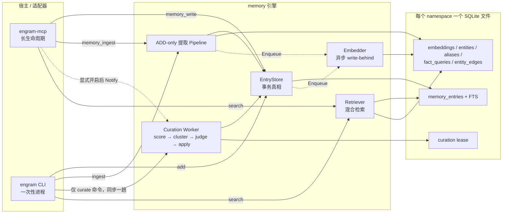
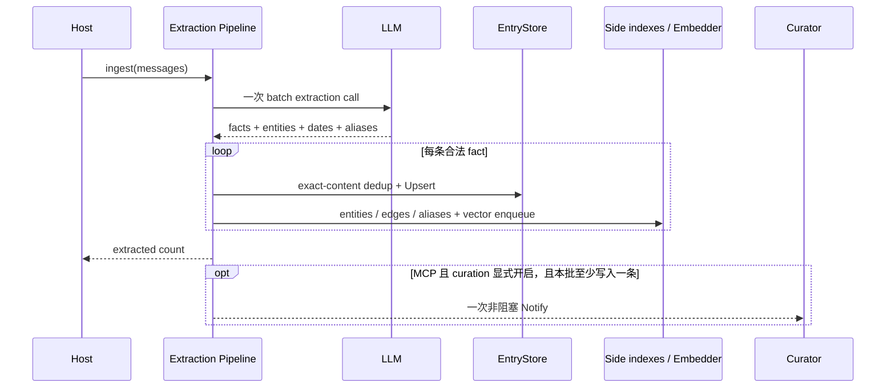
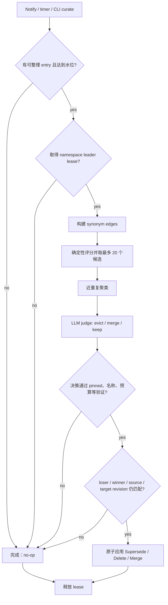
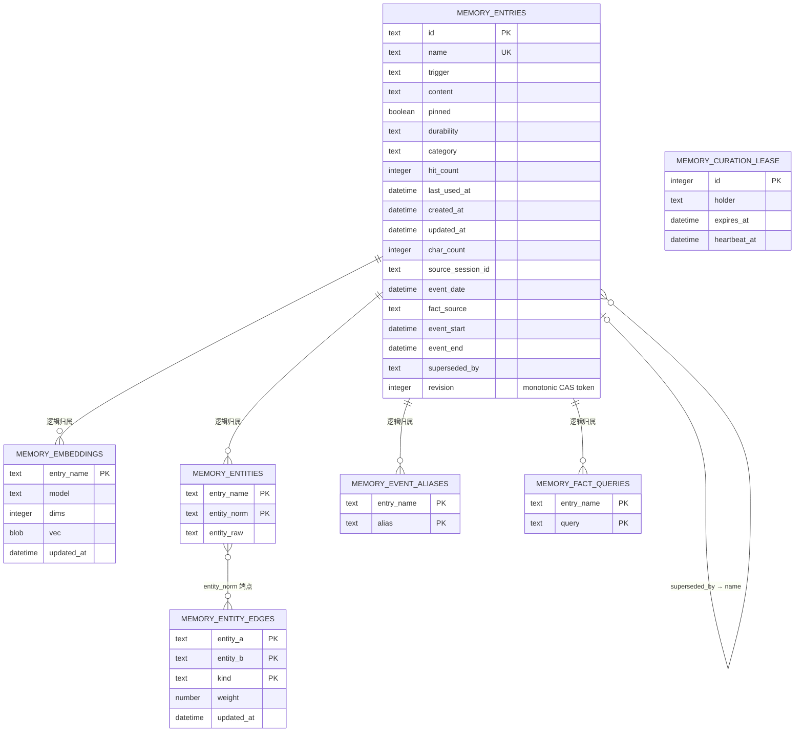
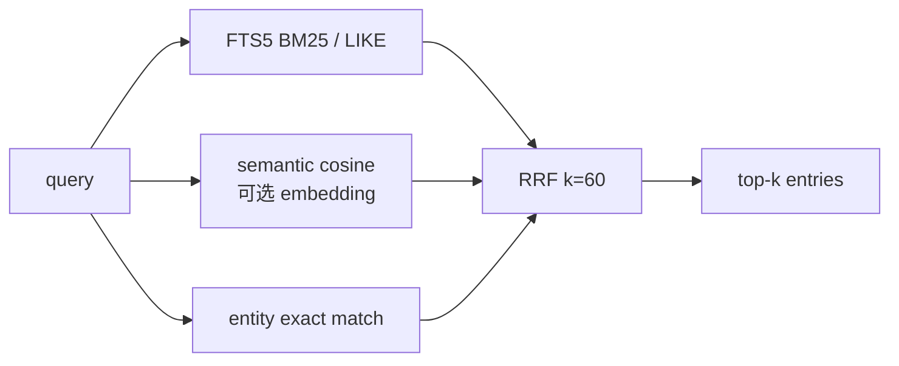

# engram 记忆架构、提取与存储

> 🧭 **状态**：活跃 · **目标**：一处说明记忆何时进入系统、如何检索和整理，以及
> SQLite 中的真实存储结构。

## 1. 总体架构

适配器只负责命令、配置和 namespace 生命周期；抽取、存储、检索、embedding 与
curation 都在 host-agnostic 的 `memory/` 引擎中。namespace 不写入表字段，而是直接
隔离为 `<data-dir>/<namespace>.db`。

## 2. 记忆什么时候被提取

当前没有“自动监听所有对话”的隐式入口。只有显式调用以下入口才会提取：

- MCP `memory_ingest`：一次请求中的全部 `user`/`assistant` 消息组成一个 batch。
- CLI `engram ingest`：stdin 中的一组对话行组成一个 batch。

`memory_write` / `engram add` 不做 LLM 提取，它们直接写入调用方给出的记忆。

提取采用 ADD-only 语义：

1. 整批对话只发起一次 LLM extraction call。
2. 解析结构化 facts，校验内容预算、日期范围、category 和 durability。
3. 用精确 `content` 去重；已有相同内容时跳过。
4. 新 fact 写入 `memory_entries`，并写 entity、共现 edge、event alias。
5. 正文与 alias shadow embedding 进入非阻塞 write-behind 队列。
6. 提取错误、单条非法 fact 或索引失败按 fail-safe 处理，不会删除旧记忆。

## 3. Curation 什么时候发生

curation 与“提取”不同：提取只新增 fact；curation 负责在积累后合并近重复、淘汰低价值
内容和处理候选冲突。

### MCP：显式开启、持久异步

只有设置 `ENGRAM_CURATION_ENABLED=true` 或
`--curation-enabled=true`，并配置 LLM 后才创建 worker。每个打开的 namespace
恰好一个 worker；`memory_write` 每次成功写入后通知，`memory_ingest` 每个成功 batch
只通知一次。通知是容量为 1 的非阻塞去抖信号，因此请求不等待 curation。

worker 被唤醒后仍要满足至少一个水位才执行 judge：

- 非 pinned entry 数量大于 80；
- manifest 估算大于 2000 字符；
- 从未完成过 pass，或距上一趟至少 30 分钟。

此外，30 分钟 timer 提供没有新写入时的兜底检查。每趟最多选 20 个候选，完整 pass
最长 2 分钟。LRU 淘汰或 server 关闭时执行
`cancel → Wait → drain embedder → close store`。

### CLI：显式命令、同步一次

`engram curate` 构造一个一次性 worker，直接同步调用一趟 `RunPass`，不启动后台 loop。
进程会等待 pass 完成，最长 2 分钟。普通 `add` / `ingest` 不会触发 curation。

### 一趟 pass 的内部流程

模型错误、JSON 解析错误、非法决策、lease 丢失或取消都安全 no-op；只有验证通过的
决策能修改存储。

## 4. 同步与异步耗时

没有固定的“平均秒数”，主要变量是本地扫描规模和 LLM 首 token/完整响应耗时。稳定
契约如下：

| 模式 | 调用方等待 | curation 实际开始 | 完成边界 |
|---|---|---|---|
| CLI `curate` | 同步等待 | 命令内立即检查并执行 | 单趟最多 2 分钟；无候选时通常只是本地 DB 检查 |
| MCP write/ingest | 不等待 curation，只承担写入与 O(1) Notify | worker 收到通知后立即检查水位，或 30 分钟 timer 兜底 | 单趟最多 2 分钟 |
| MCP 写入发生在已有 pass 期间 | 不等待 | 最多保留 1 个 pending wake | 当前 pass 与下一次检查合计理论上可接近 4 分钟；若不再满足水位，下一次检查会 no-op |

2 分钟是 pass deadline，不是“保证两分钟内一定发生 merge”。跨进程 lease 被其他实例
持有、未达到水位或 judge 选择 keep 时，本趟都会无修改结束。

## 5. 一次性与持久模式的取舍

| | CLI 一次性同步 | MCP 持久异步 |
|---|---|---|
| 优点 | 结果边界清楚；脚本可用退出码判断；不常驻 goroutine；不会给普通写入增加模型成本 | 写入低延迟；自动去抖；定时兜底；持续控制长期库膨胀；每 namespace 生命周期完整 |
| 缺点 | 人工/调度器显式执行；命令会等待 LLM；频繁运行会重复进程和 provider 初始化 | 需要长期服务和 LLM；后台成本与动作不在写请求中直接可见；关闭必须等待在途 pass |
| 适合 | 手工维护、CI/cron、一次性本地脚本 | 长期运行的 Agent、MCP 客户端、多轮持续写入 |

## 6. SQLite 存储结构

补充结构：

- `memory_entries_fts` 是 base entry 的 FTS5 mirror。
- `memory_event_aliases_fts` 是 alias 的 FTS5 mirror。
- embedding 的逻辑 key 是 `name`、`name#alias`、`name#query`。
- side table 没有外键；ownership 是应用层事务约束。
- schema v6 的 `revision` 由数据库单调递增；`updated_at` 只用于时间语义。后台
  delete/merge/supersede 和迟到 embedding 用 `id + revision` 原子拒绝旧快照。
- Delete/Merge 会在同一事务内精确清理三类 vector、entities、aliases/FTS、
  fact-queries、失效 reverse supersession 和无引用 entity edge。
- 若 shadow key 同时是另一条存活 entry 的真实 name，清理优先保留该共享 vector key，
  防止误删无关 entry；彻底消除这种历史命名歧义需要后续 owner-aware schema。

## 7. 检索流程

embedding 未配置时 semantic signal 直接缺席，keyword + entity 仍可工作；这是明确的
降级模式，不会阻止离线启动。
