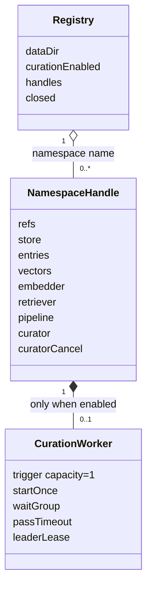
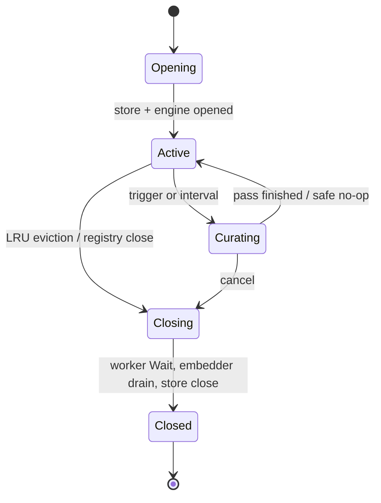
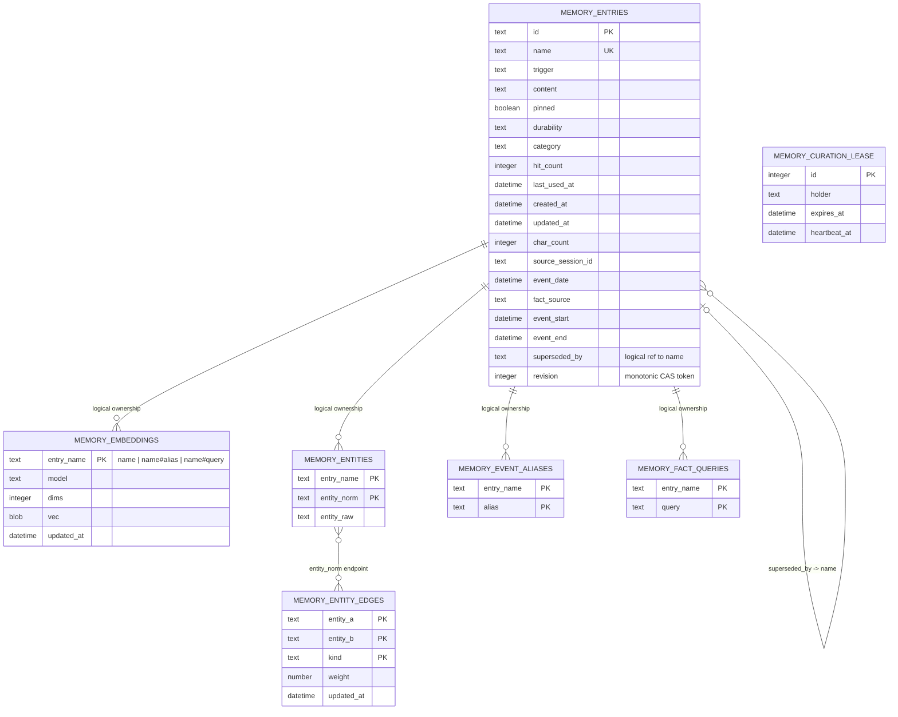
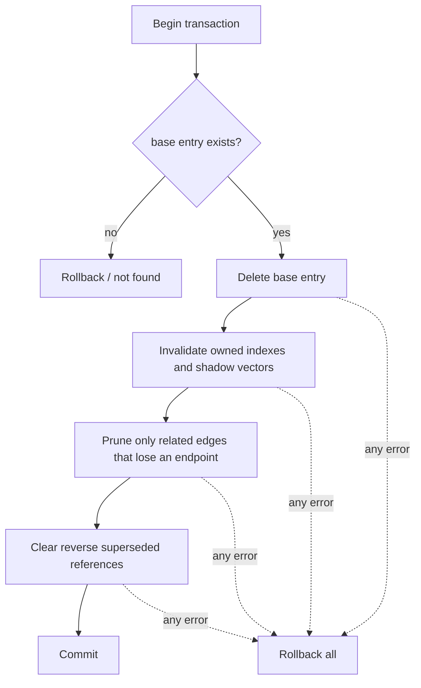
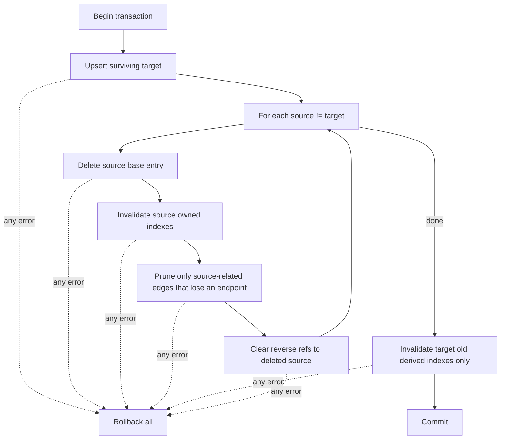
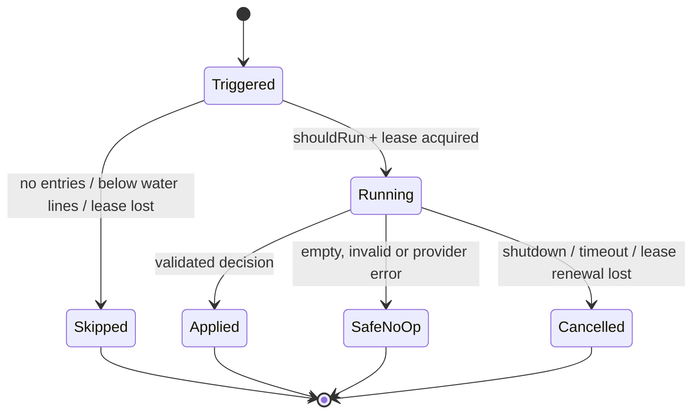

# Data Model: Curation 生命周期与记忆索引完整性

## 1. Namespace 运行时模型

namespace 仍由适配器映射到独立数据库；引擎 schema 不新增 namespace 字段。

### NamespaceHandle 状态

### 运行时不变量

- 一个 active handle 对应一个 namespace 数据库。
- curation 关闭时 `curator` 和 `curatorCancel` 均不存在。
- curation 开启时，一个 handle 最多一个 worker loop。
- pending trigger 数量只能是 0 或 1。
- handle 进入 Closing 后不再接受新的 curation pass。
- store 只能在 worker 已结束、embedder 已排空之后关闭。
- namespace 被重新打开时创建全新 handle/worker，不重启旧 Worker。

## 2. 持久化结构

FTS mirrors are trigger-maintained：

- `memory_entries_fts` 随 `memory_entries` insert/update/delete 同事务更新。
- `memory_event_aliases_fts` 随 `memory_event_aliases` insert/update/delete 同事务更新。
- 两个 FTS mirror 都不是应用直接清理的独立真相。

side table 没有数据库外键；上图中的 ownership/reference 都由 EntryStore 事务维护。
若 `name#alias` / `name#query` 同时是另一条存活 base entry 的真实 name，单列 schema
无法证明该 vector row 只属于 shadow；清理按 FR-018 优先保留该共享 key。

`memory_entries.revision` 由 schema v6 引入：已有行升级后为 1，insert 默认 1；
同名 upsert 及会影响 curation 判断的 entry 状态更新在数据库内递增。`updated_at`
仍是时间元数据，不是并发版本。后台 delete/merge/supersede 与条件 vector 写入均以
`id + revision` 验证快照；Supersede 同时验证 loser 和 winner。

## 3. 归属与清理矩阵

| 数据 | 归属键 | Delete(name) | Merge source | Merge surviving target |
|---|---|---|---|---|
| base entry | `name` | 删除 | 删除 | upsert 后保留 |
| base vector | `name` | 删除 | 删除 | 删除旧值，等待重建 |
| alias shadow vector | `name#alias` | 删除 | 删除 | 删除旧值，等待重建 |
| query shadow vector | `name#query` | 删除 | 删除 | 删除旧值，等待重建 |
| entity rows | `entry_name=name` | 删除 | 删除 | 删除旧值，等待重建 |
| event aliases | `entry_name=name` | 删除，FTS trigger 跟随 | 同左 | 同左，等待重建 |
| fact queries | `entry_name=name` | 删除 | 删除 | 删除旧值，等待重建 |
| reverse supersession | `superseded_by=name` | 清空 | 清空 | 保留 |
| entity edges | endpoint entity | 无引用端点才 prune | 同左 | 同左 |

## 4. Delete 状态转换

## 5. Merge 状态转换

### Merge 不变量

- `into.Name` 即使也出现在 source names 中也必须存活。
- 指向已删除 source 的 `superseded_by` 清空。
- 指向存活 target 的 `superseded_by` 保留。
- target 的旧派生索引不能与新内容并存。
- 任一 SQL 失败时，base/side/edge 状态整体回到调用前。

## 6. Curation Pass 状态

pass 的 deadline 覆盖候选扫描、synonym 构建、judge、lease heartbeat 和 apply。只有
通过现有验证的决策可以修改存储；pinned 或未知名称继续被拒绝。
