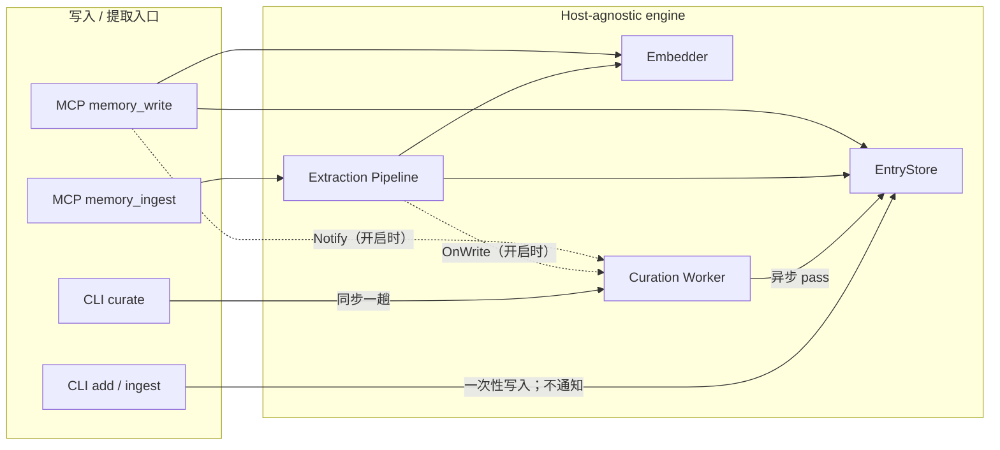

# Implementation Plan: Curation 生命周期与记忆索引完整性

**Branch**: `018-curation-lifecycle-cleanup` | **Date**: 2026-07-28 | **Spec**: [spec.md](spec.md)

**Input**: Feature specification from
`/specs/018-curation-lifecycle-cleanup/spec.md`

## Summary

本功能补齐两个已确认的生命周期缺口：

1. 在 MCP 适配器显式开启后，为每个 namespace 装配并运行现有 curation worker，
   将单条写入和 ADD-only 提取批次接到非阻塞通知；CLI 新增一个同步、单次、两分钟
   上限的 `curate` 命令，普通 `add`/`ingest` 保持原样。
2. 扩展引擎的删除/合并事务，使基础记忆、正文/别名/查询向量、实体、事件别名、
   fact-query、失效替代引用和无引用实体边在一个事务内保持一致。

技术方案不改变 curation 评分、judge prompt 或检索融合。schema v6 为
`memory_entries` 增加数据库维护的单调 `revision`，使异步 apply 与 embedding 不依赖
可能重复的时间戳；引擎同时新增可复用默认配置、pass deadline 和可等待的 worker
生命周期，适配器只负责配置、namespace 装配和命令呈现。



## Technical Context

**Language/Version**: Go 1.25.0

**Primary Dependencies**: Go 标准库（`context`、`sync`、`time`、`log/slog`）；
`modernc.org/sqlite`；官方 MCP Go SDK。无新增第三方依赖。

**Storage**: 每个 namespace 一个本地 SQLite 文件；单连接、WAL、FTS5 trigram。
`memory_entries` 是基础真相，多个无外键 side table 存放可重建索引与共享实体边。

**Testing**: Go `testing`；真实临时/内存 SQLite；stub LLM/embedding；MCP SDK
in-memory transport；`CGO_ENABLED=0` build/test；`go vet`；确定性 retrieval parity。

**Target Platform**: 可交叉编译的本地 CLI 与 stdio MCP server；Linux/macOS/Windows，
核心路径无 CGO。

**Project Type**: 公共 Go 记忆引擎库 + MCP/CLI 薄适配器。

**Performance Goals**:

- 成功写入后的 curation 通知为 O(1) 非阻塞操作，未消费通知最多 1 个。
- 每趟 judge 候选最多 20 条，整趟默认不超过 2 分钟。
- 默认关闭时不创建 curation goroutine、不增加模型调用或全库扫描。
- 删除/合并继续使用单事务；不增加启动时全库孤儿扫描。

**Constraints**:

- 默认离线、显式开启、模型 provider 可替换；密钥只来自环境变量。
- 一个 namespace 同时最多一个后台 loop，跨进程最多一个 lease holder。
- 关闭顺序固定为 cancel worker → Wait → drain embedder → close store。
- 不修改已发布 migration；新增独立 v6 revision migration，不新增外键，不改变 MCP
  工具清单或检索算法。
- 引擎行为测试先失败再实现；所有变更必须在 `CGO_ENABLED=0` 下通过。

**Scale/Scope**: 当前产品诚实边界为单用户约 10 万条记忆。judge 输入被限制为
20 个候选，但现有 synonym 构建在首次面对大型历史库时可能触发较大扫描；两分钟
deadline 是安全边界，不承诺在 10 万条历史库首次开启时完成一趟。启用后从默认
80 条水位持续维护是主要运行形态。

## Constitution Check

*GATE: Must pass before Phase 0 research. Re-checked after Phase 1 design.*

| Principle / Gate | Pre-design | Post-design evidence |
|---|---|---|
| I. 本地优先、默认离线 | PASS | curation 默认关闭；开启后仍可使用本地 sidecar；无托管服务依赖。 |
| II. 引擎/适配层分离 | PASS | timeout、Wait、清理事务属于 host-agnostic 引擎契约；MCP/CLI 仅装配和呈现。 |
| III. 契约优先、namespace 隔离 | PASS | [contracts/curation-contract.md](contracts/curation-contract.md) 固定配置、错误与时序；每 ns 独立 store/worker。 |
| IV. 评测回归门 | PASS | 确定性门与全套测试通过；显式授权后的 canonical LoCoMo 1540×3 多数票为 86.10%，参考基线为 85.71%，配对 McNemar p=0.585（within-noise、无显著回退）。 |
| V. 优雅降级、规模诚实 | PASS | 未开启零影响；后台错误不反向失败写请求；大型历史库首次 pass 的限制已声明。 |
| 无 CGO / 依赖最小化 | PASS | 仅标准库同步/上下文能力；新增纯 SQLite v6 revision migration，无新依赖。 |
| 单一存储真相 | PASS | 所有适配器继续共享现有 SQLite schema；不增加平行状态。 |
| 测试先行 | PASS（任务门） | storage、worker、MCP、CLI 各自先写失败测试，见后续 `tasks.md`。 |

无宪法违规，不需要 Complexity Tracking 例外。确定性 parity 证明默认关闭路径的直接
不变量，但不替代宪法 IV 对 storage/curation 变更的最终可比评测。

## Project Structure

### Documentation (this feature)

```text
specs/018-curation-lifecycle-cleanup/
├── spec.md
├── plan.md
├── research.md
├── data-model.md
├── quickstart.md
├── contracts/
│   └── curation-contract.md
└── tasks.md
```

### Source Code (repository root)

```text
memory/
├── entrystore.go                 # Delete/Merge 原子 side-table 清理
├── entrystore_test.go            # 删除/合并完整性与回滚
├── vectorstore.go                # owner revision 条件向量写入
└── curation/
    ├── worker.go                 # 默认配置、pass timeout、Start/Wait
    └── worker_test.go            # 生命周期、deadline、幂等

store/
├── migrations.go                 # schema v6 单调 entry revision
└── migrations_test.go            # upgrade/default revision 契约

mcpserver/
├── config.go                     # 显式 curation 配置
├── registry.go                   # 每 namespace worker 装配/关闭
├── tools.go                      # memory_write 通知；ingest 由 pipeline 通知
├── registry_test.go
├── provider_test.go
└── tools_test.go

cmd/
├── engram/
│   ├── engine.go                 # 一次性 curator 装配，不启动 loop
│   ├── run.go                    # curate 路由
│   ├── curate.go                 # 同步单次命令与诊断
│   └── *_test.go                 # 命令、能力、超时、普通命令不触发
└── engram-mcp/
    ├── main.go                   # config 透传与启动状态
    └── main_test.go

docs/
├── cli.md                        # curate 使用与同步耗时边界
└── mcp-server.md                 # 显式开关、异步语义与生命周期
```

**Structure Decision**: 复用现有单仓库分层。存储与 worker 的通用能力只改
`memory/` 与独立 v6 migration；MCP/CLI 分别在自己的适配器目录装配，不能互相共享
私有状态。无需新 package 或第三方依赖。

## Design Details

### 1. Curation 默认配置与 pass 边界

在 `memory/curation` 提供唯一的 `DefaultConfig()`，供 MCP 与 CLI 复用：

| Setting | Default |
|---|---:|
| entry high-water | 80 |
| minimum interval | 30 minutes |
| lease TTL | 60 seconds |
| manifest budget | 2000 chars |
| max candidates | 20 |
| content snippet | 1200 chars |
| weights | hit 1.0 / recency 1.0 / age 0.5 / volatility 0.5 |
| entry budgets | `memory.DefaultBudgets()` |
| pass timeout | 2 minutes |

`RunPass` 从调用者 context 派生 pass deadline。模型、lease heartbeat、扫描和 apply
共用该 context；deadline 后不得继续 apply。现有 fail-safe 契约不变：模型或解析错误
记录 WARN 并 no-op，不反向传播给后台写请求。

### 2. Worker 生命周期

`Start` 用一次性启动门和 wait group 保证一个 Worker 最多一个 loop；`Wait` 允许宿主
在释放数据库前等待 loop 和正在执行的 pass 退出。一次 cancel 后不支持重启同一
Worker；namespace 重开会创建新 handle/worker。

MCP namespace context 必须来自 registry 生命周期，不得来自单次 `Acquire` 请求。
handle 关闭时先 cancel/Wait，再排空 embedder，最后关闭 store。

### 3. MCP 装配

`RegistryConfig` 增加 `CurationEnabled`。开启但 `LLMCaller == nil` 时
`NewRegistry` 失败。每个新 handle 先创建 worker，再将 `worker.Notify` 作为 pipeline
`OnWrite`，最后启动 worker并发布 handle。

`memory_write` 绕过 pipeline，因此成功 Upsert 并 enqueue embedding 后显式 Notify。
`memory_ingest` 只依赖 pipeline 的每批一次 OnWrite，避免双重通知。

### 4. CLI 同步单次命令

`engineHandle` 在 LLM caller 可用时构造 curator，但不调用 `Start`，也不为 pipeline
设置 OnWrite。`runCurate` 对命令 context 加两分钟 deadline，直接调用一趟
`RunPass` 并等待返回。缺能力返回 capability 错误；deadline/cancel 返回失败；合法
no-op 或模型无效决策按保守完成输出。普通 `add`/`ingest` 没有 curation 通知。

### 5. 删除与合并事务

拆分两个事务内 helper：

- **派生失效**：删除 `name`、`name#alias`、`name#query` 三类向量，以及该 name 的
  entities、event aliases、fact queries；alias FTS 由现有 trigger 同步。
- **真实删除附加清理**：清空其他 entry 指向 deleted name 的 `superseded_by`。

Delete 先确认并删除基础 entry，再执行两类清理。删除每个 entry 的 entity rows 前，
只检查触及这些 entity 的边；若边的任一端点在排除该 entry 后不再被任何
`memory_entities` 行引用，才删除该边。Merge 对被消费 source 执行真实删除，对存活
target 只执行派生失效并使用同一局部 prune。这样既避免误删共享关系，也不会把一次
Delete/Merge 扩大成历史孤儿全库 sweep。

### 6. Review hardening：revision 与关闭线性化

后台 judge 的输入是旧快照，应用时不能只按 name。EntryStore 为 curation 提供：

- `DeleteIfUnchanged`：在 base delete 的同一 SQL 中核对 `id + revision + pinned=0`；
- `MergeIfUnchanged`：在 Merge 事务内核对所有 source、既有 target 或“target 仍未
  被并发创建”，任一变化时整项 no-op；
- `SupersedeIfUnchanged`：单条 UPDATE 同时核对 loser/winner 的 `id + revision`，
  loser 当前仍非 pinned 才写入；
- vector 条件 upsert：只有 owner 的 `id + revision` 仍匹配时才落库。

revision 由 schema v6 持久化，insert 默认 1；同名 upsert、usage、supersede 与
reverse-supersession 变更都在数据库内 `revision + 1`。`updated_at` 继续用于展示和
排序，不再承担 CAS 语义。

`RunPassContext` 只把 pass 实际观察到的 caller cancel/deadline 交给同步 CLI；已提交后
才发生的 cancel 不会误报失败。heartbeat 在 pass 返回前 join。Registry LRU 在锁内
detach 并设置同 namespace closing marker，在锁外执行慢关闭，避免阻塞无关 namespace。

## Complexity Tracking

无需要证成的宪法偏离。

## Evaluation Gate Status

2026-07-28 已通过：

- `CGO_ENABLED=0 go test -count=1 ./...`
- `CGO_ENABLED=0 go build ./...`
- `CGO_ENABLED=0 go vet ./...`
- memory retrieval parity/degradation focused tests
- MCP parity/isolation/offline focused tests
- `CGO_ENABLED=0 go test -count=1 ./cmd/locomo-bench`
- schema v6 revision、相同时间戳 CAS 与 Supersede 双端校验 focused tests（50 repeats）

同日取得维护者 **¥16 硬上限**的显式成本授权后，完成可比 LoCoMo 端到端门禁：

- 数据/店：`locomo10.json` 全量 1540 题，隔离复制
  `.locomo-run/009-bge-chunks-store`，`extract_calls=0`。
- 模型栈：Qwen `Qwen/Qwen3.6-35B-A3B-FP8` answer、与店内模型标识一致的
  `BAAI/bge-large-en-v1.5` embed、`deepseek-v4-flash` judge。
- canonical 参数：`--chunks --top-k 30 --chunk-quota 12 --retrieval hybrid
  --force-answer --judge-mem0-aligned --repeats 3 --concurrency 40`。
- regime：
  `force_answer=true;abstain_prompt=false;no_idk_retry=false;judge=mem0-aligned;judge_model=deepseek-v4-flash;retrieval=hybrid`。
- 三次分数：85.58%（1318/1540）、85.52%（1317/1540）、86.17%（1327/1540）；
  均值 **85.76%**，95% CI **[84.87%, 86.65%]**。
- 三次多数票：当前 **1326/1540 = 86.10%**，参考
  `.locomo-run/009-full-A-base` **1320/1540 = 85.71%**，净 +6 题。
- 逐题比较：当前错/基线对 39，当前对/基线错 45，McNemar
  **p=0.585379**，CI 重叠，verdict=`within-noise`；没有显著回退。
- 上下文均值 3616.98 token（参考 3613.56，+0.09%）；answer 4630 次、
  judge 4620 次、extract 0 次，产物在
  `.locomo-run/018-curation-gate-full/`。
- 干净门禁的 DeepSeek judge 实测 usage 成本 **¥1.74**。计入两次 2 题预检、
  一次被及时隔离的模型标识失配 warm-up（1540+62 题）与约 21 分钟受控 GPU
  窗口后，本次总费用估算约 **¥4.45**（公开 GPU 单价口径），低于 ¥16 上限。

短模型名 warm-up 被归档到 `.locomo-run/018-curation-gate-cold-warmup/`，未进入门禁：
其请求模型名与原店的完整模型名不一致，只加载了部分语义向量。正式门禁前已从原始
canonical store 重新隔离复制，不能把该配置伪影混入可比结果。

因此 T028、SC-009 与宪法 IV 均完成，本 feature 可以进入合并验证。
