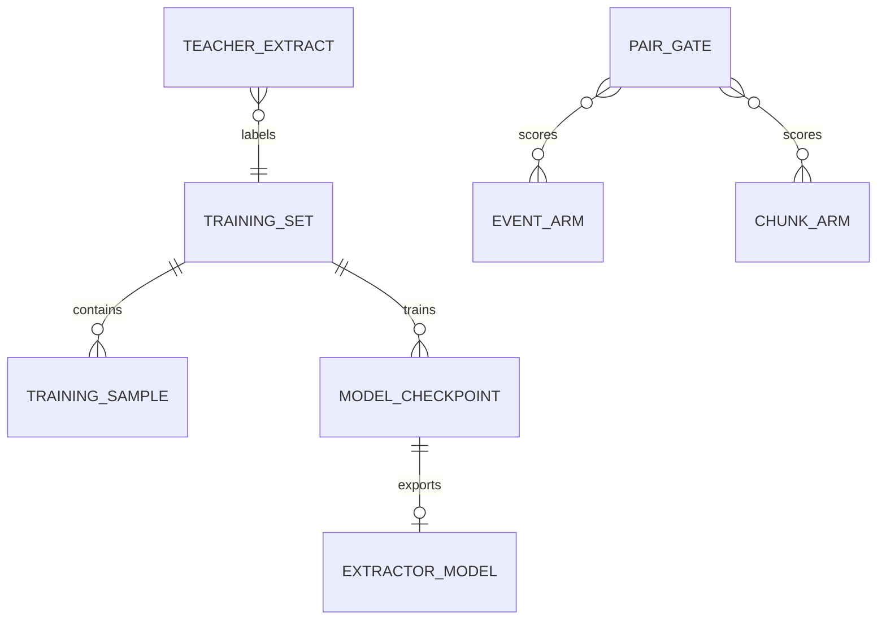

# Data Model: 写入侧事件抽取训练化

**Date**: 2026-08-05 · **Spec**: [spec.md](spec.md)

本 feature 的数据实体与校验规则。训练数据与配对结果用于验证"训练能否解 027 失败点"；模型产物为 SaaS 线写侧结构地基。

## 实体总览

## E1. Training Sample（事件级训练样本）

训练抽取器的最小单元：一段对话输入 → 一条时间锚定的双视角 event 输出。

| 字段 | 类型 | 校验 | 说明 |
|---|---|---|---|
| `id` | string | 必填，唯一 | 样本 ID |
| `conv_id` | string | 必填 | 源对话（`conv-N`） |
| `source_msg_id` | string | 必填 | 源消息（027 的 SourceLedgerID） |
| `input_text` | string | 必填，非空 | 消息文本（可含 `[source_id=...]` 标记） |
| `context_turns` | string[] | 可空 | 前序对话上下文（会话内） |
| `event_json` | object | **必填，过 027 ValidateLenient** | 双视角 event：fact_entries / relation_entries / AbsoluteTS / RelativeRef |
| `abs_time_label` | string | 条件必填（事件含时间语义时） | **强制相对→绝对**的监督标签（如 `"2023-01-09"`） |
| `source` | enum(`teacher`,`human_refined`) | 必填 | 标注来源 |
| `revised` | bool | 必填 | 是否经人工修订 |
| `revision_notes` | string | 可空 | 人工修订记录（FR-002 可审计） |

**校验规则**：
- `event_json` MUST 通过 027 `ValidateLenient`（丢弃未知 relation_type，保留事件）
- 含时间语义的事件 MUST 有 `abs_time_label` 且为绝对时间（YYYY-MM-DD 或 ISO 日期），否则视为锚定失败
- `source=human_refined` 的样本 MUST 有 `revision_notes`

## E2. Model Checkpoint / Extractor Model（训练产物）

| 字段 | 类型 | 校验 | 说明 |
|---|---|---|---|
| `model_id` | string | 必填 | 基座 + 版本（如 `qwen2.5-3b-028-r1`） |
| `base_model` | string | 必填 | 基座模型名 |
| `train_data_version` | string | 必填 | 训练数据版本（git 或 hash） |
| `hyperparams` | object | 必填 | lr / epochs / batch / seed（FR-003 可复现） |
| `metrics` | object | 必填 | 时间锚定率 / 合法率 / 幻觉率 |
| `quantized` | enum(`fp16`,`int8`,`int4`,`none`) | 部署时必填 | US3 部署形态 |
| `deployed_as` | enum(`local_vllm`,`hosted`,`none`) | 部署时必填 | US3 |

**校验规则**：US2 交付前 MUST 记录完整 metrics（时间锚定率 ≥70%、合法率 ≥95%、幻觉率 ≤5%，SC-002）。

## E3. Pair Gate（配对门禁记录）

每阶段 GO/NO-GO 的唯一真相来源（FR-005/006）。

| 字段 | 类型 | 校验 | 说明 |
|---|---|---|---|
| `stage` | enum(`us1_teacher`,`us2_trained`) | 必填 | 阶段 |
| `n_questions` | int | = 84 | 配对题数（027 子集） |
| `repeats` | int | ≥ 3 | answerer 重复次数 |
| `event_majority` | float | 必填 | event 臂 majority 正确率 |
| `chunk_majority` | float | 必填 | chunk 臂 majority 正确率 |
| `delta_pp` | float | 必填 | event − chunk（百分点） |
| `mcnemar_p` | float | 必填 | 配对差异 p 值 |
| `time_anchor_rate` | float | 必填 | 抽取事件带绝对时间比例 |
| `schema_legal_rate` | float | 必填 | schema 合法率 |
| `hallucination_rate` | float | 必填 | 幻觉抽样率 |
| `verdict` | enum(`GO`,`NO-GO`) | 必填 | 阶段判定 |
| `evidence_path` | string | 必填 | 配对结果文件路径 |

**判定规则**：
- US1 GO：`time_anchor_rate` 5%→≥50% 且 `delta_pp` ∈ [−10, +∞)
- US2 GO（008 铁律）：`time_anchor_rate` ≥70% + 合法率 ≥95% + 幻觉 ≤5% + `delta_pp` ≥ 0
- US3 GO：本地基线不回归 + 单独口径登记

## E4. Teacher Extract（教师抽取记录）

US1 的审计记录（教师标注可追溯）。

| 字段 | 说明 |
|---|---|
| `teacher_model` | DeepSeek-v4-pro |
| `prompt_version` | 027 event prompt + 时间锚定强化指令 |
| `n_messages` | 抽取消息数（5882 目标） |
| `n_success` / `n_schema_fail` / `n_anchor_fail` | 成功 / schema 失败 / 锚定失败计数 |
| `cost_usd` | 教师 API 成本 |

## 与 027 的关系

E1 的 `event_json` 直接复用 027 的 Event schema（`memory/eventstore/event.go`），训练产物经 027 的 `eventstore.ModelCaller` 接口接入 harness——数据模型不新增引擎契约。
